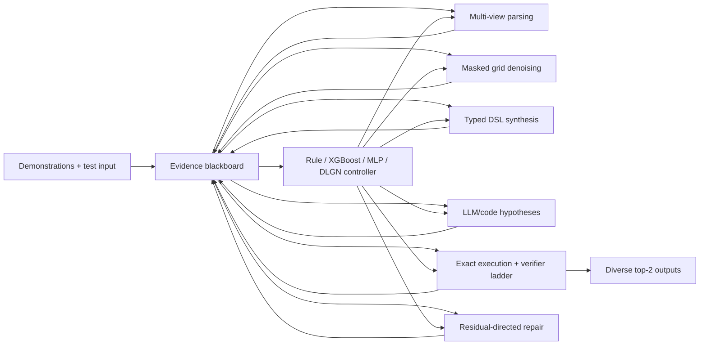

# System Architecture Contract

## 1. Abstraction boundary

For task \(\tau\), let

\[
D_\tau=\{(x_i,y_i)\}_{i=1}^{n}, \qquad X_\tau^*=\{x_j^*\}_{j=1}^{q}.
\]

The solver does not classify \(\tau\) into one fixed task type. It maintains a
blackboard \(B_t\) and repeatedly chooses a bounded action:

\[
B_t=(D_\tau,X_\tau^*,P_t,C_t,V_t,R_t,H_t,b_t),
\]

where \(P_t\) is a beam of parse hypotheses, \(C_t\) the candidate pool,
\(V_t\) verification evidence, \(R_t^{\mathrm{deploy}}\) deployable residual
descriptions, \(H_t\) the action history, and \(b_t\) the remaining compute budget.

The control decision is

\[
(m_{t+1},a_{t+1})\sim
\pi_\theta(\,\cdot\mid \Phi(B_t),m_t),
\]

where \(m_t\) is a functional mode and \(a_t\) is a mode-specific action. The
controller observes demonstrations and execution evidence, not only the query grid.

## 2. Shared blackboard and specialist functions



The "brain region" analogy maps to specialist functions with different inductive
biases and a shared workspace. No module is anatomically or biologically identified.

## 3. Functional modes

| Mode | Purpose | Strong inductive bias | Typical exit evidence |
|---|---|---|---|
| `PARSE` | Create or revise object/relational views | connectivity, color roles, containment, symmetry | parse stability or program compatibility |
| `SHAPE` | Propose output dimensions | demonstrated dimension relations, object extents | shape posterior and cross-view agreement |
| `GRID_PROPOSE` | Generate output-grid candidates | 2D masked discrete denoising | candidate diversity and model uncertainty |
| `PROGRAM_PROPOSE` | Search typed DSL programs | executable compositional rules | train execution residual and MDL |
| `CODE_PROPOSE` | Generate open-vocabulary solvers or macros | code-model priors and tool use | sandboxed execution result |
| `EXECUTE` | Materialize candidate outputs and traces | exact deterministic semantics | result, exception, and cost |
| `VERIFY` | Accumulate evidence without overclaiming certainty | exact match, equivariance, consistency | keep/repair/reject features |
| `REPAIR_GRID` | Re-mask selected output regions | local spatial reconstruction | exact recovery or residual change |
| `REPAIR_PROGRAM` | Mutate/inpaint operations, bindings, or parse | typed local edit | exact execution or MDL change |
| `ESCAPE` | Recover from a bad parse, shape, or transition prior | low-probability exploration | new non-equivalent candidates |
| `SUBMIT` | Select two diverse output hypotheses | exact evidence and calibrated ranking | terminal budget or confidence gate |

Current executable scope is deliberately narrower than this table. M03a implements
only one blind input-basis integer axis ratio and projects it onto query-input
dimensions; DSL v0.2 can realize that ratio as pixel scaling or whole-grid tiling.
M02b independently records full-span separator bands and indexed panel sequences or
lattices, including ragged edge panels; DSL v0.3 can overlay only equal-shape
two-axis panels with a declared transparent background and row-major priority. DSL
v0.4 additionally applies one parameterized D4 group step by relative index from a
dynamically inferred seed in an equal-shape single-axis panel sequence, then
reassembles the original canvas. DSL v0.5 broadcasts one inferred full-size seed
over a two-axis panel congruence class and clips only at shorter final rows/columns.
M02c independently records external singleton-to-filled-rectangle row/column rays
over the fixed M02a 4-connected single-color view. DSL v0.6 can copy marker colors
to the first aligned rectangle-boundary cells through
`paint_bbox_contacts(background)`, with explicit ambiguity, collision, occlusion,
and incompatible-geometry failures. Arbitrary stamping, multiple-seed merging,
nearest-anchor motion, general relational rendering, and other shape rules remain
future specialists rather than hidden branches inside current primitives.

## 4. Dynamic transition legality

A fixed global adjacency matrix is too brittle. Legality is defined per candidate,
parse hypothesis, and next action. Within one parse, a predicate has one of four
evidence values:

- `true`: the precondition is established;
- `false`: the precondition is contradicted;
- `unknown`: the current state lacks enough information;
- `inconsistent`: the same parse contains positive and negative evidence.

Across the active parse beam, an action is hard-blocked only when every viable parse
returns `false`. If any parse returns `true`, it is allowed. `unknown` and
`inconsistent` remain searchable with predeclared penalties and may trigger
`PARSE_EXPAND`. In the primary conservative configuration, 5% of the expansion budget
is reserved for escape actions from the all-false set. A hard-pruning variant is
reported only after demonstrating at least 99.5% correct-output survival on
generator-known synthetic tasks.

The per-parse contract is:

\[
L_t^{(c,p)}(i,j)=\operatorname{eval}_4\left[
\operatorname{post}(m_i,B_t)\models\operatorname{pre}(m_j)
\right].
\]

The legality layer is a safety and efficiency prior, not the next-action policy.
Synthetic tasks report true-path recall; real ARC reports correct-output survival and
version-space diagnostics because the intended program path is normally unknown.

## 5. Residual evidence and leakage boundary

Residuals are three disjoint objects:

- \(R_{\mathrm{demo}}\): differences between candidate execution on demonstration
  inputs and the known demonstration outputs, including typed counterexamples;
- \(R_{\mathrm{query,int}}\): query evidence observable without its answer, such as
  model uncertainty, cross-augmentation disagreement, violations of invariants
  inferred from demonstrations, source disagreement, and execution/type failures;
- \(R_{\mathrm{oracle}}\): a candidate's difference from the hidden or held-out query
  answer.

Only \(R_t^{\mathrm{deploy}}=(R_{\mathrm{demo}},R_{\mathrm{query,int}})\) may enter a
repair mask, ranker, controller, stopping rule, or hyperparameter decision.
\(R_{\mathrm{oracle}}\) is evaluation-only: it may define an oracle-mask ceiling or
post-hoc error-stratification bucket after all predictions are frozen. Every repair
mask records which deployable evidence produced each marked cell, AST node, or action.

## 6. Three diffusion targets

### 6.1 Grid diffusion

Given a proposed shape, condition on demonstrations and iteratively reconstruct
masked output tokens. For repair, construct a mask from low confidence, symmetry
violations, object-boundary disagreement, or program residuals:

\[
c_t^{(k-1)}\sim p_\phi(c_t^{(k-1)}\mid c_t^{(k)},D_\tau,
M(R_t^{\mathrm{deploy}})).
\]

Here \(t\) indexes the outer execute-verify-repair round and \(k\) the denoising
step. This is the first neural diffusion target because it has a direct ARC precedent.

### 6.2 Program or trace diffusion

Represent a typed trace as tokens for modes, operations, arguments, references, and
stops. Mask a suspect span and reconstruct it while conditioning on execution state:

\[
u_t^{(k-1)}\sim p_\psi(u_t^{(k-1)}\mid u_t^{(k)},D_\tau,
\operatorname{Exec}(u_t^{(k)}),R_t^{\mathrm{deploy}},L_t).
\]

This is an experimental repair operator, not assumed to outperform mutation or beam
search.

### 6.3 Controller-state diffusion

A denoised functional schedule may propose several future mode traces, but a one-shot
schedule cannot react to new execution evidence. It is therefore future work, not a
main experiment. The initial system uses a stepwise receding-horizon policy.

## 7. Candidate intermediate representation

Every source writes the same immutable candidate record. Missing fields are explicit,
not silently imputed.

```text
candidate_id
task_id_hash
test_index
source_type                 # grid_diffusion | dsl | code | recursive_net | rule
source_version
parent_candidate_ids
parse_hypothesis_id
shape_hypothesis
output_grid
program_ir_or_code_hash
functional_trace
generation_parameters
model_confidence
execution_status
train_exact_count
train_pixel_residual
object_relation_residual
equivariance_checks
coordinate_dependence
description_length
duplicate_class
cost_cpu_ms / cost_gpu_ms / model_calls
evidence_status
```

Code text and full traces may live in content-addressed sidecar files. The record must
retain enough provenance to reproduce any submitted output.

## 8. Multi-view parsing

Maintain `parse_beam x program_beam`, including at least:

- raw pixels and color masks;
- 4- and 8-connected components;
- single-color and multicolor objects;
- foreground hypotheses with alternate backgrounds;
- bounding boxes, holes, lines, corners, and frames;
- containment and adjacency graphs;
- repeated motifs, grids/panels, and symmetry axes.

No single segmentation is declared correct before a candidate program or output
provides cross-demonstration evidence.

## 9. Verifier ladder

Hard rejection is reserved for logically necessary conditions. Preferences remain
soft scores.

1. **Format:** rectangular grid, valid colors, declared shape.
2. **Type and execution:** typed program, deterministic execution, no sandbox error.
3. **Demonstration fit:** exact and structured residuals across every pair.
4. **Transformation consistency:** colors, objects, dimensions, and bindings share a
   rule across demonstrations.
5. **Equivariance probes:** color permutations and valid geometric augmentations.
6. **Anti-overfit evidence:** absolute-coordinate use, exceptional patches, program
   length, and parameter derivability.
7. **Cross-source agreement:** canonical output and trace clusters.
8. **Submission selection:** calibrated score plus output diversity; two identical
   attempts are used only when evidence overwhelmingly favors one output.

Train exactness is necessary for a strict program candidate but is not sufficient to
identify the intended query output.

## 10. Repair actions

- re-mask low-confidence or verifier-identified grid regions;
- change the output shape hypothesis;
- substitute one typed primitive;
- repair an argument or object binding;
- inpaint a short operation span;
- rebind the same program to another parse hypothesis;
- induce a verified macro from code, then re-execute it;
- switch candidate source;
- cold restart with a new augmentation or seed.

Each action logs its parent, residual before and after, exact recovery, novelty, and
cost. Repair is successful only when it increases exact task recovery at matched
budget, not when it merely lowers pixel error.

## 11. Four separate decision interfaces

Four learned or hand-built decisions use distinct contracts and datasets:

1. **Legality layer:** candidate/parse/action precondition evidence; optimized for
   correct-output survival and search reduction.
2. **Frozen-pool candidate ranker:** candidate evidence to ordering; optimized for
   recall@k, calibration, and official two-attempt score on an identical pool.
3. **Online next-action policy:** deployable blackboard state and budget to a generator,
   executor, verifier, or repair action; optimized end to end under matched budgets.
4. **Top-2 selector:** a ranked, verified set to at most two distinct answer grids per
   test pair; optimized for the official two-attempt pair-fraction score.

XGBoost, MLP, DLGN, or rules may instantiate more than one interface, but a main
experiment replaces only one interface at a time. Training labels and features are
never silently shared across the four roles.

## 12. Controller comparisons

All controllers receive the same frozen feature view and candidate pool where
applicable:

- static round robin;
- hand policy with declared thresholds;
- random or bandit allocation;
- logistic regression / decision tree;
- XGBoost;
- small MLP;
- DLGN and discretized DLGN;
- optional expensive LLM judge used only as a late-stage reference.

Primary controller metrics are final pass@2 and accuracy-cost frontier. Auxiliary
metrics are action regret against an offline oracle, true-candidate survival, repair
yield, calibration, and source allocation.

The primary online protocol is not a frozen-pool experiment. Each controller receives
identical generator checkpoints, action definitions, seed policy, and resource ledger,
then produces its own trajectory. Frozen pools are used only for ranker experiments.
Offline policy learning must either enumerate every available action or declare the
logging policy and off-policy correction.

## 13. Failure decomposition

Report at least these mutually inspectable bottlenecks:

For one test pair, define nested events \(S\): correct shape considered, \(G\): exact
answer generated, \(F\): exact answer survives filtering, and \(T\): exact answer is
selected in the two attempts. The empirical funnel obeys the probability chain rule:

\[
P(T)=P(S)P(G\mid S)P(F\mid G,S)P(T\mid F,G,S).
\]

This is an empirical diagnostic, not an independence assumption or upper bound.
Executor failure, timeout, parse miss, and DSL miss are additionally recorded as
attributed failure categories. Official dataset score then averages exact test-pair
outcomes within each task and averages the resulting task fractions.
