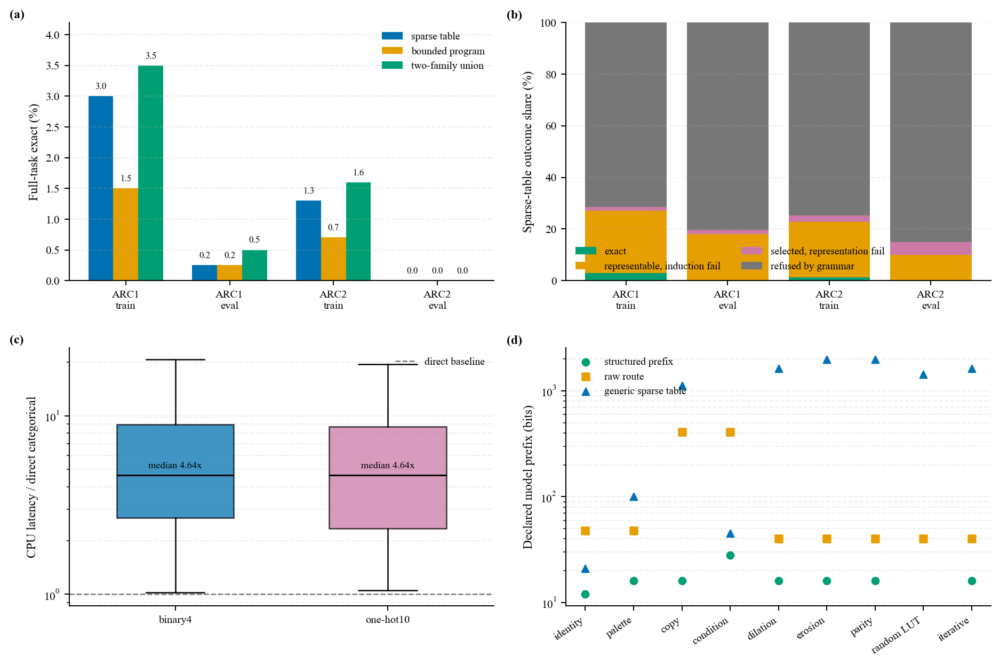

# 元胞自动机、ARC 与逻辑门兼容性：冻结实验报告

## 结论

本轮结果支持一个窄而明确的结论：**有限、离散、局部且共享的 CA
转移可以无损编译为逻辑门；但“可以门化”并不等于“从少量示例学到了正确规则”，
也不自动带来压缩或执行优势。**

在冻结提交 `888573d15de3c865e339677df8d2e804e999ff88` 上：

- 四个 ARC 完整 split 共得到 464 个被选择的 split-task 局部规则实例（不是 464 个
  唯一逻辑函数）；direct categorical、
  binary4 和 one-hot10 在所有测试输入上 **464/464 完全一致**，非法解码率为 0。
- ARC-AGI-2 training 的表规则为 13/1000，结构化 copy/propagation 程序为
  7/1000，两族并集为 16/1000。
- 唯一一次 ARC-AGI-2 public evaluation 回执结果为：表规则
  pass@1=0/120、pass@2=0/120，结构化程序=0/120。18 个被选择规则仍保持
  18/18 门化等价，但没有一个得到完整任务正确输出。
- 在 464 个 ARC 规则实例上，binary4 和 one-hot10 的 NumPy CPU 中位延迟均为
  direct categorical 的约 **4.64 倍**。这不是硬件 PPA，但当前解释执行没有速度优势。
- 当正确的结构化语法已经给定时，描述可以显著缩短；当规则是随机 LUT 时，
  40-bit raw route 短于 1426-bit generic sparse-table prefix。压缩来自合适的语言，
  不是来自“门”这个表示本身。

因此，当前结果没有支撑“LGN 在保持通用 ARC 效果几乎不变时已经取得优势”。
它支撑的是更小的命题：**对已经识别出的有限局部规则，硬门编译可保持语义；
真正瓶颈主要位于规则归纳、局部状态/拓扑、输出接口和迭代控制。**



## 冻结协议

实验合同在读取 ARC-AGI-2 evaluation 结果前写入
[`arc-ca-contract.md`](../notes/design/arc-ca-contract.md)。两轮独立只读审查清零了
P0/P1 后才冻结代码。冻结过程要求：

1. solver 只接收 demonstrations 和 test inputs；test outputs 位于独立的 evaluator
   对象中；
2. ARC-AGI-2 evaluation 无法绕过 full receipt，也不能使用 task limit；
3. 固定 source commit、GitHub origin、dataset commit、全 worktree clean、task-ID
   digest 和内容 digest；
4. full 模式对每个被选择规则执行全部三种 codec，不允许 128-entry 抽样；
5. 在评分前独占创建外部 ledger，保存逐 test-input 的 attempt 1/2 或显式 abstain；
6. 运行结束重新检查 source HEAD/clean，并用 metadata SHA-256 完成 ledger。

冻结提交先在 210 的全新 clone 中通过 111/111 测试，再推到 GitHub `main`。
加入结果工件与回执检查后，当前提交候选的完整套件为 113/113，其中 25 项为
ARC 数据、求解器、程序、编译器或工件协议的专项测试。
ARC-AGI-2 evaluation ledger 含两条记录，状态依次为
`reserved_before_scoring`、`completed`；绑定的 `metadata.json` SHA-256 为
`fd3cd2543fbdaeed3c895786cdf26e2be02e0ac437df5e6d67c7cd7a58495f38`。
这是一份声明式 one-shot 证据；它不能证明有人从未在程序外查看公开标签。

## 方法

### 稀疏 categorical CA

候选语法固定为 29 个邻域：center、radius-2 内的 24 条单 offset wire，及
radius-1/2 的 von Neumann/Moore 邻域。一个候选只有在同一张确定性局部表精确拟合
全部 demonstrations 且输入输出同形时才可用。未见邻域回退到 center color，并单独
记录 support。排序只使用：leave-one-demonstration-out pair exact、cell accuracy、
描述前缀上界和固定名称。

### 独立结构化程序族

第二个结果层只包含 identity、radius-2 copy wire 和单一颜色对的 4/8-neighbor
单调传播，horizon 为 `1,2,3,4,8,fixed_point`。它不与 sparse table 偷偷合并；
两族分别报告 pass@1，并报告并集作为保守的 two-family pass@2 下界。

### 门化桥

每个 sparse rule 以三种方式执行：

- direct categorical table；
- 4-bit state 的 constant-equality/multiplexer 网络；
- 10-state one-hot 输出与第 11 个 input-only boundary state 的网络。

门数是无共享的构造性上界，不是综合最小值；CPU 时间也不是 FPGA/ASIC PPA。
固定点程序另计局部转移、逐 cell 状态相等、全局归约和停止控制。

## 完整 split 结果

| 数据集与 split | 分母 | sparse pass@1 | program pass@1 | 两族并集 | sparse coverage | post-hoc local oracle |
|---|---:|---:|---:|---:|---:|---:|
| ARC-AGI-1 training | 400 | 12 (3.00%) | 6 (1.50%) | 14 (3.50%) | 114 (28.50%) | 108 (27.00%) |
| ARC-AGI-1 evaluation | 400 | 1 (0.25%) | 1 (0.25%) | 2 (0.50%) | 79 (19.75%) | 72 (18.00%) |
| ARC-AGI-2 training | 1000 | 13 (1.30%) | 7 (0.70%) | 16 (1.60%) | 253 (25.30%) | 227 (22.70%) |
| ARC-AGI-2 evaluation | 120 | 0 (0.00%) | 0 (0.00%) | 0 (0.00%) | 18 (15.00%) | 12 (10.00%) |

ARC-AGI-2 的表规则 pass@2 与 pass@1 相同：training 均为 13，evaluation 均为 0。
第二个 demonstration-ranked sparse rule 没有新增完整任务成功。

`post-hoc local oracle` 把 demonstrations 与 test labels 一起用于检查“是否存在某个
冻结邻域规则”，它泄漏标签，只用于表示能力诊断，绝不是 solver score。正因如此，
它能将失败拆开：

| split | exact | oracle 可表示但归纳失败 | 已选择但 test 不可局部表示 | 语法拒绝 |
|---|---:|---:|---:|---:|
| ARC-AGI-1 training | 12 | 96 | 6 | 286 |
| ARC-AGI-1 evaluation | 1 | 71 | 7 | 321 |
| ARC-AGI-2 training | 13 | 214 | 26 | 747 |
| ARC-AGI-2 evaluation | 0 | 12 | 6 | 102 |

ARC-AGI-2 evaluation 的 102 个语法拒绝又分为：63 个 demonstrations 内存在局部
冲突，39 个输入输出 shape 改变。即使把 grounding 问题完全移除——ARC grid 已是
离散颜色符号——当前局部语法仍不能覆盖多数任务。

训练集上的成功与 test-neighborhood support 高度相关：ARC-AGI-2 training 的 13 个
sparse 成功任务中位 support 为 1.0，而其余被选择但失败任务的中位 support 约为
0.123。evaluation 的 18 个被选择任务中位 support 仅约 0.0289。这不是因果证明，
但与“少量 demonstrations 无法识别或覆盖正确局部表”的归纳瓶颈一致。

## 门兼容性与执行成本

四个 split 的 ARC rule-instance 总数为
`114 + 79 + 253 + 18 = 464`。三路结果为：

| 指标 | binary4 | one-hot10 |
|---|---:|---:|
| direct 等价 | 464/464 | 464/464 |
| 最大非法解码率 | 0 | 0 |
| 中位静态门上界 | 4120 | 1614.5 |
| 每 cell state bits | 4 | 10 |
| CPU slowdown 中位数 | 4.643× | 4.640× |
| CPU slowdown IQR | 2.684×–8.950× | 2.338×–8.703× |
| 比 direct 更快的实例 | 24/464 | 22/464 |

one-hot 在当前 equality/mux 构造中使用较少的门上界，但付出 10 versus 4 state bits；
binary4 的跨四个 split 动态门上界之和约为 `7.99e8`，one-hot 约为 `2.88e8`。
这些数只用于同一声明式构造的内部比较，不能替代布局、共享、综合、存储访存和技术库
映射后的 PPA。

于是“效果几乎不变”需要分两层回答：

- 对**已选择的局部规则语义**：是，当前观察域上完全不变；
- 对**神经/连续 ARC solver 的端到端效果**：没有做 matched soft-NCA versus hard-LGN
  非劣实验，不能声称保持；当前离散 solver 自己在 ARC-AGI-2 evaluation 为 0/120。

## 压缩：结构化语言有效，generic 门化不保证有效

synthetic ladder 覆盖局部映射、copy、条件规则、形态学、parity、迭代传播，以及
global/resize/task-context/random 负例。局部与迭代正例的 direct/binary4/one-hot
语义完全一致；global majority、shape change、缺失 task context 和 random global
output 被明确拒绝。

几个声明式 model-prefix 对比：

| 任务 | structured + wrapper | raw route | generic sparse table + wrapper |
|---|---:|---:|---:|
| identity | 12 bits | 48 bits | 21 bits |
| copy north | 16 bits | 408 bits | 1120 bits |
| binary dilation | 16 bits | 40 bits | 1619 bits |
| binary parity | 16 bits | 40 bits | 1979 bits |
| random binary LUT5 | 不适用 | 40 bits | 1426 bits |

这些长度依赖预先公开的代码语言，不是语言无关的 Kolmogorov complexity。它们说明：

- 正确的 structured prior 可以把规则压缩到很短；
- generic categorical-to-gate 编译器可能比 raw LUT 大几十倍；
- 随机规则应诚实走 raw escape，而不是强迫“解释”；
- ARC 失败行没有编码 residual outputs，故这里的 `total_description_bits` 只是模型
  prefix，不是完整 two-part MDL 或端到端压缩率。

迭代同样不能免费。31×31 的 dilation 在固定 8 步时终态 accuracy 仅 15.09%；
运行至 fixed point 需要 31 步并达到精确终态，声明动态门上界为 297,879，其中停止
检测约占 60%。ARC-AGI-2 training 的任务 `9edfc990` 虽由结构化 fixed-point 程序
精确解决，但局部转移上界为 71,680，停止检测再增加 40,952，总计 112,632。

## 与现有 CA/NCA 工作的关系

Google 的 [Differentiable Logic Cellular Automata](https://arxiv.org/abs/2506.04912)
在固定 wiring 上训练 16 种 Boolean gate 的 soft mixture，并把门 argmax 硬化；其公开
结果集中在 Game of Life 和 pattern generation，而不是 ARC。本仓库此前已经对其公开
hard circuits 做 commit-pinned replay，并统一了 256 个 ECA、Game of Life、density
classification、global synchronization、checkerboard repair 和 Boolean wavefront
pathfinding；详见 [`cellular_automata_zh.md`](cellular_automata_zh.md)。本轮 ARC 扩展沿用
同一个证据边界：局部规则短，不代表全局任务容易；area × steps × active gates 仍是
运行成本。

真实 2D ARC 的 NCA 文献当前主要针对 ARC-AGI-1。Xu 与 Miikkulainen 报告的
[task-specific NCA](https://arxiv.org/abs/2506.15746) 在过滤后的 172 个 public-training
任务中解决 23 个；[ARC-NCA](https://arxiv.org/abs/2505.08778) 的主要表格使用 262 个
non-resize public-evaluation 任务，同时另有 maximal-padding 全问题实验。这些模型、
训练预算、过滤规则和当前 demonstration-only hard CA 完全不同，不能把百分比当成公平
排行榜。当前全分母 ARC-AGI-1 evaluation 的两族并集只有 2/400，说明这个冻结的小语法
远弱于 task-specific continuous NCA，而不是证明 NCA 不可门化。

CAX 报告的 60.12% 来自简化的 1D-ARC，而非 2D ARC-AGI-1/2；不能拿来支持当前
ARC solver。ARC-AGI-2 的来源、任务数和 changelog 固定在
[`arc_agi_manifest.json`](../third_party/arc_agi_manifest.json)。

## 对 neuro-symbolic 前提的回答

“规则可压缩、grounding 高置信、数据布局稳定”在 neuro-symbolic AI 中**不是普遍前提**。
它们在离散棋盘、协议状态机、固定邻域验证、量化形态生成和重复局部约束中较常见；CA
正是对这些条件最有利的测试床。但开放视觉/语言 grounding、动态对象与关系拓扑、概率
语义、变量绑定、递归证明、规划和 shape-changing 输出通常只满足其中一部分。

ARC 提供了更强的反证：输入已经是无感知噪声的符号 grid，布局上限也是 30×30；即便
grounding 可视为 100% 可靠，ARC-AGI-2 evaluation 仍有 85% 任务无法从 demonstrations
选择冻结局部规则，剩余 15% 也全部失败。稳定像素布局不等于稳定的对象关系、任务语义、
输出接口或传播 horizon。

合理的工程边界因而是：

```text
neural grounding / candidate generation
    -> confidence and compressibility routing
    -> compact hard local rule when supported
    -> explicit state/search/controller (BFS, Datalog, SAT, planning, probabilistic inference)
    -> residual or neural fallback when unsupported
```

LGN 更适合替换已经满足离散、稀疏、可复用条件的局部 kernel；它不应被要求单独承担
视觉 grounding、对象发现、动态拓扑学习和通用搜索。

## 产物与复现

完整、未筛任务的结果位于：

- [ARC-AGI-2 training](../results/runs/arc_ca_v1_arc2_training_full_210_888573d/metadata.json)
- [ARC-AGI-2 evaluation](../results/runs/arc_ca_v1_arc2_evaluation_full_210_888573d/metadata.json)
- [ARC-AGI-2 evaluation receipt](../results/runs/arc_ca_v1_arc2_evaluation_full_210_888573d.receipt.jsonl)
- [ARC-AGI-1 training](../results/runs/arc_ca_v1_arc1_training_full_210_888573d/metadata.json)
- [ARC-AGI-1 evaluation](../results/runs/arc_ca_v1_arc1_evaluation_full_210_888573d/metadata.json)

每个目录都包含 task、program、codec、summary、逐题 predictions 和 metadata；
metadata 记录命令行、环境、source/data hashes 和全部 artifact hashes。绘图脚本会先重算
所有输入哈希，再从原始 CSV 生成 PDF/PNG：

```powershell
.\.venv\Scripts\python.exe figures\arc_ca_results_plot.py
.\.venv\Scripts\python.exe -m unittest discover -s tests -v
```

ARC-AGI-2 evaluation one-shot 已经消费，不应为了“复现”再次评分；其完整 argv、两次
attempt grids 和 receipt 都已归档。开发者可以在训练 split 或自建任务上运行
[`run_arc_ca.py`](../src/run_arc_ca.py)，但任何基于 evaluation 逐题结果调 solver 的改动
都应当视为新协议，而不是延续当前回执。
