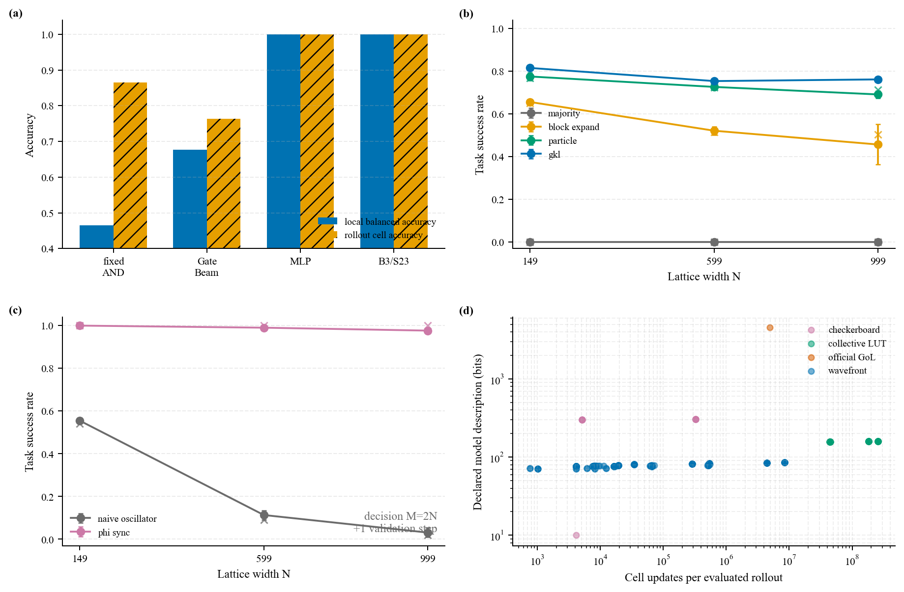

# 逻辑门元胞自动机：复现、任务统一与边界

## 1. 结论先行

这轮扩展支持一个比“LGN 能替代通用神经符号推理”更窄、也更可靠的结论：**当任务确实由平移共享的局部离散状态转移构成时，逻辑门网络可以作为可编译的 CA 更新程序，并把同一份规则跨空间和时间复用；但长程协调、状态存储、更新调度和训练期软门反传仍可能是主瓶颈。**

最强的正证据来自 Google 发布的硬电路，而不是本项目重新训练出的模型：

- 发布的 Game of Life（GoL）电路在全部 512 个 `3×3` 局部配置上零错误，并在 `128×128`、300 步随机周期网格上与标准 GoL 逐 bit、逐步完全一致。
- 发布的 checkerboard 电路在 16×16/20 步、64×64/80 步、`fire_rate=0.6` 异步更新，以及“前 40 次更新的每一步之后都钳零中央实际 20×20 区域、随后释放 40 步”的官方自修复协议下，可见第 0 通道均达到 100%。异步复验公开使用 NumPy PCG64 schedule，并不冒充 notebook 的 JAX PRNG 逐 bit 重放。官方 notebook 的损失本来就只监督第 0 通道；其余隐藏通道约 0.69–0.72 的“目标一致率”只是内部状态诊断，不能当作任务错误。
- 完整 Boolean wavefront 在全部测试 maze 上与独立 BFS 的可达性和最短距离一致；固定 16 步版本只有 50% 成功率，说明递归 horizon 并未被五门局部规则消除。

但“效果不变”不等于已经证明“更快”或“更省硬件”：本项目只有 CPU NumPy 解释执行、静态门数和动态操作量，没有 FPGA/ASIC PPA。官方 GoL 发布电路每个 cell update 解释 223 个输出可达逻辑节点；在 `128×128×300` 测试中是约 `1.096×10^9` 次逻辑节点求值。规则只编码一次，运行工作却没有消失。

所有数值来自：

- [`cellular_automata_local_rule_results.csv`](../results/cellular_automata_local_rule_results.csv)
- [`cellular_automata_task_results.csv`](../results/cellular_automata_task_results.csv)
- [`cellular_automata_official_results.csv`](../results/cellular_automata_official_results.csv)
- [`cellular_automata_complexity_results.csv`](../results/cellular_automata_complexity_results.csv)
- [`cellular_automata_metadata.json`](../results/cellular_automata_metadata.json)

## 2. Google 工作究竟证明了什么

用户所指工作是 Miotti 等人的 [*Differentiable Logic Cellular Automata*](https://doi.org/10.1162/isal.a.882)，官方提供了[文章页面](https://google-research.github.io/self-organising-systems/difflogic-ca/)和 [JAX notebook](https://github.com/google-research/self-organising-systems/blob/master/notebooks/diffLogic_CA.ipynb)。每个二输入节点训练时对完整 16 种布尔函数做 softmax 混合，部署时取 argmax 硬化；Moore 邻域和层内连线是固定的，只学习门型。

因此必须区分三层证据：

1. **发布硬电路语义复验**：固定已训练门和连线，验证 JSON 解释器、局部真值表和 rollout。本轮已经完成。
2. **局部转移监督训练**：GoL 用全部 512 个局部配置学习一步转移，属于 system identification，不是隐藏规则发现。
3. **任务级隐藏规则训练**：checkerboard 只在最终图案上监督，更接近“由全局任务发现局部规则”。本轮复验了发布硬电路，但未成功启动 JAX 重训练。

官方冻结资产固定在 `pages@4c0246d9f7a2912cb7201f6bfe5fcda0fe373904`，下载后强制 SHA-256 校验。GoL JSON 的 4215 条 connector 只有 435 条唯一语义边；解释器允许完全相同的重复边，但拒绝同一端口的不同驱动。发布 GoL 子图含 223 个输出可达逻辑节点、组合深度 19；论文另报告 336 个排除 A/B pass-through 的 active gates。两者来自不同 artifact/counting scope，不能据此反推某个确定的剪枝阶段。checkerboard JSON 含 6 个门，其中同源 `AND(x,x)` 可消去，所以等效为论文所述的 5 个功能门。

训练复现工具已写入 [`run_official_difflogic_gol.py`](../src/run_official_difflogic_gol.py)，直接执行 SHA-256 固定的官方 notebook 定义。实际训练尚未运行：210/236 SSH 在握手前超时，本地隔离环境从 PyPI 和清华镜像获取 JAX 0.4.33 也分别受 SSL/proxy 阻断。状态保存在 [`difflogic_ca_training_attempt.json`](../results/difflogic_ca_training_attempt.json)，所以这里不报告任何训练收敛率或 learned active-gate 数。

## 3. 统一任务层级

本轮没有把“所有 CA 论文”粗暴合并成一个 accuracy，而是按计算性质接入四层：

| 层级 | 当前实验 | 证据含义 |
|---|---|---|
| 局部规则识别 | 全 256 个 ECA、Rule 110、GoL 512 配置 | 能否精确表示或学习局部转移 |
| 全局协调 | density classification、global synchronization | 短局部规则能否通过长程动力学完成全局任务 |
| 算法执行 | Boolean wavefront pathfinding | 局部 recurrence 能否实现 BFS 式传播，以及 horizon/状态成本 |
| 形态生成与修复 | 官方 checkerboard 同步、异步、损伤恢复 | 终态监督下的局部规则能否稳定生成和修复模式 |

经典 density 规则来自 Mitchell、Crutchfield 和 Hraber 的[原始研究](https://doi.org/10.1016/0167-2789(94)90293-3)；同步规则来自 Das 等人的[作者版论文](https://melaniemitchell.me/PapersContent/EGSCA.pdf)。后者把成功定义为最多约 `2N` 步内进入全 0/全 1 交替吸引子，且不给部分分。路径任务以 [Pathfinding Neural Cellular Automata](https://arxiv.org/abs/2301.06820) 为任务参照，但本轮实现的是给定 symbolic maze 上的五门 Boolean wavefront，不是对其连续 NCA 的重训练。



Growing NCA、self-classifying MNIST 和 CA segmentation 已收入文献图谱，但尚未被错误写成“已复现”；它们分别扩展到连续形态发生、局部分类共识和视觉分割，见 [`references.md`](references.md)。

## 4. 局部逻辑与 rollout

固定 `AND/OR/XOR/NAND` 公式基、免费常量源和 formula-tree（非最小 DAG）口径能精确覆盖全部 256 个 ECA：5 个规则需 0 门，15 个需 1 门，58 个需 2 门，129 个需 3 门，49 个需 4 门。Rule 110 在这个限定口径下的最小公式为 4 门、深度 4，但其通用网表描述为 37 bits，而 Wolfram LUT 本身只有 8 bits。因此“能门化”并不自动产生模型压缩；更不能把 Rule 110 的八行真值表复验写成 Cook 的[通用性构造](https://www.complex-systems.com/abstracts/v15_i01_a01/)。

GoL 局部/rollout 结果为：

| 方法 | 512 配置 balanced accuracy | rollout cell accuracy | 首次分歧 |
|---|---:|---:|---:|
| Fixed `center AND north` | 0.466 | 0.866 | 1 |
| GateBeam（4 层/192 beam） | 0.676 | 0.764 | 1 |
| TinyMLP（3/3 seeds） | 1.000 | 1.000 | 无 |
| `B3/S23` outer-totalistic oracle | 1.000 | 1.000 | 无 |

这回答了“学到逻辑还是没学到东西”：固定 AND 明显不够；当前 GateBeam 的小公式搜索也没有恢复九输入 GoL；MLP 可以记住完整局部表，但不会自动给出紧凑门网表。Google 发布硬电路则证明其更大的 16-op 固定拓扑训练栈确实找到了精确硬规则，但本轮没有重现其优化过程。

GoL 还暴露了 MDL 语言选择问题：把它当任意 9 输入 LUT 要 512 个输出 bit，但 `B3/S23` 只需 18-bit birth/survival masks。报告的“计数前端之后 2 个布尔谓词”不包含邻居求和与相等比较成本；这些算术工作被显式保留，而不是藏进“两门 GoL”的口号里。

## 5. 全局协调复验

full 模式使用 unbiased Bernoulli(0.5) 初态；N=149 为 3×1000 样本，N=599 为 2×256，N=999 为 2×128。它小于论文每个 N 的 10,000 样本，所以论文列只作为来源值，不与本轮置信区间混用。

| 任务/规则 | N=149 | N=599 | N=999 | 论文报告 |
|---|---:|---:|---:|---|
| density majority | 0.000 | 0.000 | 0.000 | 0 / 0 / 0 |
| density block-expand | 0.656 | 0.521 | 0.457 | .652 / .515 / .503 |
| density particle | 0.775 | 0.727 | 0.691 | .769 / .725 / .714 |
| density GKL | 0.815 | 0.754 | 0.762 | 本轮结构基线 |
| sync naive oscillator | 0.555 | 0.113 | 0.031 | .54 / .09 / .02 |
| sync `phi_sync`，M=2N 判定 + 1 验证步 | 1.000 | 0.990 | 0.977 | 1 / 1 / 1（M≈2N） |

主要趋势和论文一致，但 `phi_sync` 在本轮“第 2N 步判定、再付 1 步验证互补振荡”协议的大尺寸结果没有被四舍五入成完美复现。论文写的是 `M≈2N` 且统计“在 M 内达到”；本轮结果因此只支持“成功率对 horizon 敏感”，而不能篡改为 1.00 或用未归档的临时诊断代替主协议。

更关键的负结果是语法码长：`phi_sync` 的通用 ANF code 为 135 bits，反而长于 128-bit 原始 LUT；particle 为 125 bits，GKL 因结构显式仅 33 bits。强宏观能力与当前通用逻辑语言中的微观压缩不是同一个量。若要压缩 `phi_sync` 的“算法”，需要 domain/particle interaction 级语言，而不只是 ANF 或门表。

## 6. 路径规划：局部规则小，搜索成本仍在

Boolean recurrence 为：

```text
reached_next = passable AND (reached OR north OR west OR east OR south)
```

它可用 5 个二输入门表达。完整迭代在 16/32/64 网格上均为 100% 可达性和最短距离一致；固定 16 步在三个尺寸上均为 50%，因为构造集中一半是长蛇形可达路径、一半是阻断负例。完整 Boolean wavefront 的 CPU 平均时间随尺寸从 0.011 s 增至 0.238 s，而独立 BFS 从 0.00075 s 增至 0.0126 s。这里没有速度优势；逻辑门只提供了规整、局部、可编译的状态转移形式。

64×64 测试的完整 wavefront 平均约执行 841.7 轮，约 `1.72×10^7` 次二输入门求值，并需要两通道 cell state。于是瓶颈从“局部规则长不长”转移到了“传播直径、frontier state 和 termination control”。

## 7. CA-MDL：描述与执行必须分开

采用的 recurrence wrapper 是：

```text
L_CA(D) = L(meta, topology, boundary, schedule)
        + L(local rule or multi-output DAG)
        + L(horizon/stop)
        + L(residual | public initial state, model)
```

同时另报：

```text
dynamic work = evaluated gates per updated cell × updated cells × recurrent steps
state bits   = channels × cells
```

三个例子说明为什么不能混淆：

- 官方 GoL DigitalJS DAG 与语言 route 的声明上界码为 4541 bits，再付 topology/boundary/schedule/layout/horizon wrapper 25 bits，共 4566 bits；零误差残差仍付 1-bit 空集前缀。摊到 4,915,200 个 cell updates 后约为 0.000929 model bit/update，但实际执行约 10.96 亿逻辑节点求值。
- 64×64/80 步 checkerboard CA 的 DAG+route 为 276 bits，加入 recurrence wrapper 后为 304 bits、任务通道零误差；直接 checkerboard 生成程序只需声明 10 bits。CA 的价值在局部自组织和修复，不在比直接目标程序更短。
- `phi_sync` 只付一次 128-bit LUT，却必须执行随 `K×N×T` 增长的更新。对空间时间轨迹而言它高度可复用；对单次全局任务而言 recurrence 仍是主成本。

## 8. 对 LGN 适用前提的回答

“规则可压缩、grounding 高置信、数据布局稳定”在神经符号系统中不是普遍前提，但在以下子域较常见：离散棋盘/网格环境、物理或协议状态机、固定邻域约束、像素已量化的形态生成、重复执行的局部验证器。CA 正是把“稳定布局 + 局部共享”推到最强的特例，所以它是 LGN 的有利测试床。

在开放视觉、语言 grounding、对象数和关系拓扑动态变化、概率语义必须保留、规则需要变量绑定或递归证明时，这些前提通常只部分成立。此时更合理的系统仍是：神经 grounding/候选生成 → 置信度路由 → 可压缩局部逻辑 → BFS/Datalog/SAT/规划器或概率推理，而不是把全部计算塞进一个硬 CA。

因此当前证据支持：

- **支持**：固定、共享、局部、二值的更新规则可无损硬化并跨空间时间复用。
- **部分支持**：在目标通道上效果不变时，描述和存储摊销可很强；尚无硬件速度/功耗证据。
- **不支持**：短门网表自动解决全局协调、自动学拓扑、自动保留不确定性，或等价于通用神经符号推理。
- **明确瓶颈**：训练期 16 门软混合与 BPTT、部署期长 horizon、状态存储、同步/异步 schedule、以及从 raw input 得到可靠离散 cell state。

## 9. 复现

依赖轻量的完整实验：

```powershell
.\.venv\Scripts\python.exe src\run_cellular_automata.py --mode full --suite all
.\.venv\Scripts\python.exe src\summarize_results.py
.\.venv\Scripts\python.exe figures\cellular_automata_plot.py
.\.venv\Scripts\python.exe -m unittest discover -s tests -v
```

可选官方 JAX 训练尝试：

```powershell
.\.venv-ca\Scripts\python.exe -m pip install -r requirements-ca.txt
.\.venv-ca\Scripts\python.exe src\run_official_difflogic_gol.py --epochs 3000
```

冻结电路运行不依赖 JAX。官方资产不复制进仓库，运行时按 [`difflogic_ca_manifest.json`](../third_party/difflogic_ca_manifest.json) 的 immutable commit 与 SHA-256 下载验证。
