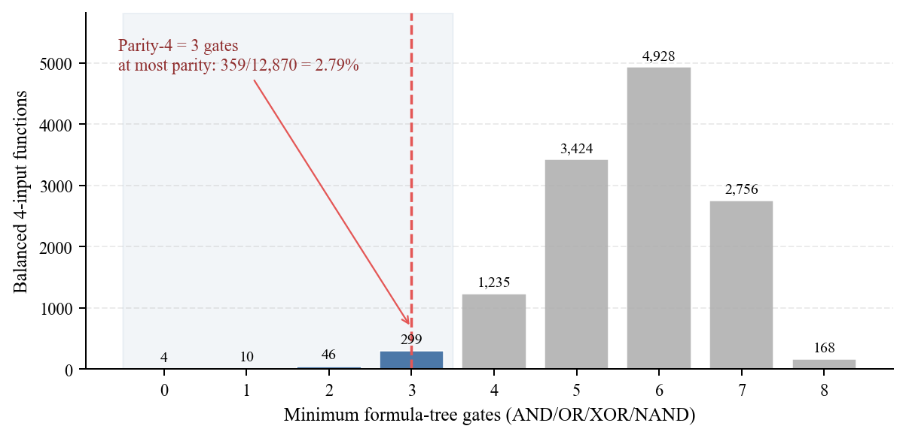
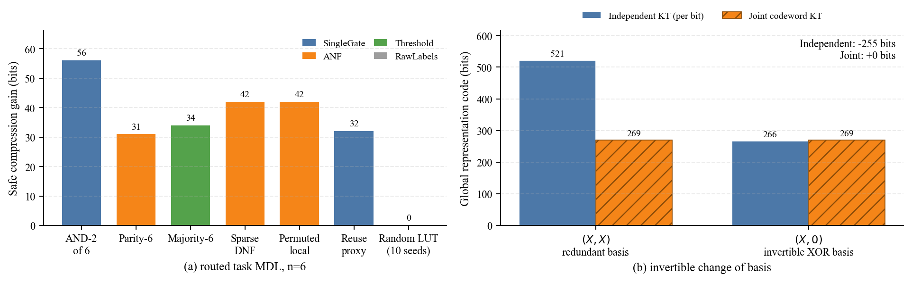

# Boolean Coding Rate Reduction：一个可执行的离散理论

## 1. 结论先行

可以建立离散理论，但它不是一个与语言无关的“Boolean entropy”。本项目采用的定义是：

> **Boolean Coding Rate Reduction（BCRR）是相对于公开、可译码、满足 Kraft 不等式的元语言，以及明确的 side-information 和失真协议所定义的净描述长度节省。**

连续 MCR² 仍负责表示几何；离散层另外负责四种成本：

\[
L_{total}
=L_{route}+L_{representation}+L_{circuit}+L_{residual}.
\]

这是统一记账模板，不是当前代码已经序列化出的单一 end-to-end payload：`run_representation_codes` 与 function/task MDL 仍是分开验证的实验。真正的联合闭环还需要固定 representation decoder、circuit grammar、残差条件关系和统一 route，再对同一任务共同优化上述四项。

硬件面积、深度、线网和切换活动可以作为带单位的外部约束或 Lagrangian 项，但不能未经换算直接冒充 Shannon bits。

本报告的可执行实现位于 `src/boolean_mdl.py`。最新完整运行覆盖 4 输入全部 65,536 个 Boolean 函数，并在 210 服务器的 clean commit `5cddc7f4bd4df878359e1e60a765cd0f4db22aa2` 上生成结果；主机、工作目录、命令、时间、锁定环境、线程设置及规范化哈希见 `results/discrete_theory_metadata.json`。

## 2. 公共条件与记账边界

所有长度都以 bits 为单位，并条件于实验双方已知：

- 输入数、输出数和 truth-table 行顺序；
- 表示码实验中的样本顺序、样本数 $N$ 和 bit 宽度 $d$；
- gate library 为 AND/OR/XOR/NAND；
- 常量 0/1 是免费 source；
- NAND 重复输入可以实现 NOT，因此 parent pair 允许重复；
- 每种语言的语法和搜索上限在看数据前固定。

本次 full run 的具体上限是：formula gate layers 为 `n=3:4, n=4:8`；threshold 整数权重绝对值为 `n=3/4:2, n=6:1`；joint codeword width 至多 20 bits。它们已写入 metadata，threshold route 的“不命中”不能被解释成对所有整数阈值模型的全局否定。

如果这些条件不是公共协议，就必须继续编码。多语言路由也必须编码 language tag，否则可以为每个 random LUT 临时创造一个单 token 语言，伪造常数码长。

## 3. 离散表示码

### 3.1 KT 二值通用码

对含 $(n_0,n_1)$ 个 0/1 的序列 $x^{N}$，Krichevsky–Trofimov 混合概率为

\[
Q_{KT}(x^N)=
\frac{\Gamma(n_0+\tfrac12)\Gamma(n_1+\tfrac12)}
{\pi\Gamma(N+1)},
\qquad
L_{KT}(x^N)=-\log_2 Q_{KT}(x^N).
\]

它是一个真实 one-part universal code，而不是把训练集经验熵当成无需参数成本的 oracle。代码使用 $\lceil L_{KT}\rceil$ 的 Shannon–Fano prefix length。来源见 Krichevsky–Trofimov 原论文，即 `reports/references.md` 第 25 项。

对 $B\in\{0,1\}^{N\times d}$，实现了两个模型族：

\[
L^{ind}_{KT}(B)=\sum_{j=1}^{d}L_{KT}(B_{:,j}),
\]

以及把整个 bit-vector 当成 $2^d$ 元符号的 joint Dirichlet-$(1/2)$ mixture。前者便宜但只捕获逐位偏置；后者捕获码字联合频率，但 alphabet 随 $d$ 指数增长。

### 3.2 Signed 与 routed reduction

若标签 $Y$ 是 decoder 已知的 side information，定义

\[
S_{\mathcal Q}(B;Y)
=L_{\mathcal Q}(B)-\sum_y L_{\mathcal Q}(B_y).
\]

有限样本下 $S_{\mathcal Q}$ 可以为负，因为每个 class codec 都要重新支付 universal regret。因此操作上定义

\[
L^{route}_{global}=1+L_{\mathcal Q}(B),
\qquad
L_{safe}=1+\min\{L_{\mathcal Q}(B),L_{\mathcal Q}(B\mid Y)\},
\]

其中 1 bit 明确编码 global/conditional route。相对于同样带 route tag 的 global baseline，

\[
\operatorname{BCRR}_{safe}
=L^{route}_{global}-L_{safe}
=\max\{0,S_{\mathcal Q}(B;Y)\}.
\]

因此非负性来自“基线仍是付费候选”，不是 entropy inequality。若改与不含 route tag 的 bare global code 比绝对长度，则还要减去这 1 bit，不能免费选择。

若 $Y$ 不是 side information，且目标是联合重构 $(Y,B)$，公平的 joint comparison 必须在两边都加入同一个 $L(Y)$：

\[
[L(Y)+L(B)]-[L(Y)+L(B\mid Y)].
\]

只在 conditional 一侧添加 $L(Y)$ 也可以形成合法码，但它回答的是另一个 operational question：传输 $Y$ 作为仅供 conditional codec 使用的 helper，而 global route 不传 $Y$。只有当 global、conditional 与 label 都采用一致的 joint universal codec，码率分别收敛到 $H(B)$、$H(B\mid Y)$ 与 $H(Y)$ 时，该差值才渐近为 $-H(Y\mid B)$。IndependentKT 是可能错设的逐坐标乘积码；例如冗余表示 `(Y,Y)` 的该 control 在当前结果中为正，因此它始终只能解释成 codec-relative helper saving，而不是 mutual information 或本文的 BCRR。实现将其输出为 `asymmetric_helper_control_bits`，仅作任务不对称对照。

### 3.3 基依赖定理与实验

令 $B=(X,X)$，其中 $X$ 是平衡 bit。施加可逆 GF(2) 变换

\[
T(b_1,b_2)=(b_1,b_1\oplus b_2),
\]

得到 $T(B)=(X,0)$。两者信息相同，但实验测得：

| 表示 | Independent KT | Joint Dirichlet-KT |
|---|---:|---:|
| $(X,X)$ | 521 bits | 269 bits |
| $(X,0)$ | 266 bits | 269 bits |

Independent KT 因换基减少 255 bits；joint code 对码字符号的双射重命名保持不变。因此“离散码短”仍然依赖 codec family。多语言路由只能为不同基提供有成本的选择，不能消除这一事实。

常量表示配无关标签时，class-conditional Independent/Joint code 的 signed saving 分别为 `-8/-11 bits`，safe BCRR 均回退为 0。这验证了 finite-sample conditional code 不保证获益。

## 4. 函数与电路描述长度

### 4.1 真值表、ANF、ROBDD、threshold 与公式

对 $f:\{0,1\}^{n}\to\{0,1\}$，raw truth table 条件长度为

\[
L_{TT}(f\mid n)=2^n.
\]

固定语言 $\lambda$ 下的语义复杂度定义为

\[
K_{\lambda}(f)=
\min_{C:\llbracket C\rrbracket=f}L_{\lambda}(C).
\]

它不是不可计算的 Kolmogorov complexity，而是相对于公开语法的模型复杂度。本实现提供：

- Onset：编码输出为 1 的行数和组合排名；
- ANF：对唯一 GF(2) Möbius 系数的非零集合编码；
- ROBDD：编码变量顺序、bottom-up reduced nodes 和 root；
- Threshold：编码有界整数权重与 threshold；
- Formula：编码拓扑有序的 AND/OR/XOR/NAND witness；
- TruthTable：固定宽度 escape route。

这里采用 Rissanen 的最短描述建模原则（参考文献 26）；ROBDD 的 canonical 范围与变量顺序优化边界分别见参考文献 29–30。

多语言复杂度为

\[
K^*(f\mid n)=
\min_{\lambda}
[L(\lambda)+K_{\lambda}(f\mid n)].
\]

### 4.2 电路 prefix code

第 $g$ 个门之前有 $M_g=n+2+g$ 个 source。对交换二输入门且允许重复 parent，可选 pair 数为

\[
P_g=\frac{M_g(M_g+1)}{2}.
\]

代码长度为

\[
L(C)=L_\delta(G+1)
+\sum_{g=0}^{G-1}
\left[
\lceil\log_2|\mathcal O|\rceil+
\lceil\log_2P_g\rceil
\right]
+L_{out}.
\]

这里 $L_\delta$ 是 Elias-delta 自定界码，单输出引用使用 $L_{out}=\lceil\log_2(n+2+G)\rceil$ bits，从输入、两个常量和全部门中选择一个输出。若未来加入非交换 gate，必须改为 ordered parent tuple；AIG 则必须额外编码 complemented edge。

### 4.3 精确公式综合定理

定义

\[
K_{\mathcal B}^{tree}(f)=
\min_{T:\llbracket T\rrbracket=f}|T|_{gate},
\qquad
\mathcal B=\{AND,OR,XOR,NAND\}.
\]

算法按 gate cost 建立 truth-mask layer。基础层包含正相输入和常量；第 $g$ 层穷举所有 $i+j+1=g$ 的左右子公式及 root operator。当前 AND/OR/XOR/NAND 全部满足交换律，因此实现只保留 `left_cost <= right_cost` 的对称代表；若加入 implication 等非交换 gate，必须恢复有序左右分解。任何 $g$-gate 公式的 root 必有这种分解，因此归纳可得：完整处理第 $g$ 层后第一次出现的函数，其 formula-tree gate count 为全局最小。

这个证明不适用于 DAG reuse。一个公式 witness 经 hash-cons 可以给出 DAG 上界，但不能证明 minimum DAG；后者需要 available-function-set BFS、SAT exact synthesis 或 UNSAT certificate。固定计算模型下的 SAT exact-synthesis 路径见参考文献 31–32。

完整 catalog 的层计数为：

| Minimum formula gates | 0 | 1 | 2 | 3 | 4 | 5 | 6 | 7 | 8 |
|---:|---:|---:|---:|---:|---:|---:|---:|---:|---:|
| All 4-input functions | 6 | 28 | 196 | 1,162 | 5,452 | 17,250 | 28,404 | 12,798 | 240 |

总计 65,536，最大 minimum formula size 为 8。

## 5. 平衡 parity 与 random 函数的离散分离

Parity-4 与所有 balanced random LUT 都满足 $H(Y)=1$，所以输出熵不能区分它们。Parity-4 的精确 minimum formula size 是 3。穷举全部

\[
{16\choose 8}=12,870
\]

个平衡 4-input 函数，得到：

| Gates | 0 | 1 | 2 | 3 | 4 | 5 | 6 | 7 | 8 |
|---:|---:|---:|---:|---:|---:|---:|---:|---:|---:|
| Balanced functions | 4 | 10 | 46 | 299 | 1,235 | 3,424 | 4,928 | 2,756 | 168 |

中位数为 6；只有 `359/12,870 = 2.79%` 的平衡函数不比 parity-4 更复杂。这比单个 random seed 更可靠，因为少数随机表确实会偶然落在短公式集合里。

更一般地，对任意固定 prefix code，uniform random Boolean function 满足 counting bound：

\[
\Pr[L(f)\le \ell]\le 2^{\ell-2^n}.
\]

它是 almost-all/high-probability 结论，不能证明某个指定 LUT 的最小门数；该 counting 思路可追溯到 Shannon（参考文献 18）。对指定函数必须另有函数特定的下界证明；在本项目的小 $n$ 固定模型中，可由完备 exact synthesis 或 UNSAT certificate 给出，但这并非唯一可能的证明技术。

## 6. 任务残差与多语言 MDL

对电路预测 $\hat Y_C$ 和 $e$ 个错误，误差 mask 使用真正可译码的组合码：

\[
L_{res}(Y\mid C)
=L_\delta(e+1)+
\left\lceil\log_2{N\choose e}\right\rceil.
\]

第一项不能省略；否则 decoder 不知道第二项使用哪个组合集合。总任务长度为

\[
L_{task}=L(route)+L(C)+L_{res}(Y\mid C).
\]

Router 包含 RawLabels，所以

\[
G_{safe}=L_{raw}-\min_C L_{task}(C)\ge0.
\]

6 输入结果：

| 任务 | 选中语言 | Total | Raw baseline | Safe gain | Errors |
|---|---|---:|---:|---:|---:|
| AND-2 of 6 | SingleGate | 12 | 68 | 56 | 0 |
| Parity-6 | ANF | 37 | 68 | 31 | 0 |
| Majority-6 | Threshold | 34 | 68 | 34 | 0 |
| Sparse DNF | ANF | 26 | 68 | 42 | 0 |
| Permuted local rule | ANF | 26 | 68 | 42 | 0 |
| Shared-factor naming proxy | SingleGate + residual | 36 | 68 | 32 | 4 |
| Balanced random LUT（10 个） | RawLabels | 68 | 68 | 0 | 0 |

最后一行说明 6 输入的 10 个 sampled random controls 都诚实回退 RawLabels，但这不是“所有随机实例都 raw”的定理：4 输入 function route 有 `1/10` 偶然由 ANF 取得更短的**带 route-tag**长度，task route 也有 `1/10` 选择 `Literal + 2 residual errors`。这正是 almost-all counting 不能替代单实例分析的例外。Shared-factor naming proxy 仅说明 MDL 不必追求零错误：短模型加 4 个残差位置仍比完整标签短。该目标可由分配律改写，且这里实际选中的是 `SingleGate + 4 residual errors`；它**没有测量 DAG 共享收益**。真正的共享子表达式实验需要多输出目标，并分别统计独立 formula references 与共享后的 unique DAG nodes。

3/4 输入时，truth table 只有 8/16 bits，language tag 和 wiring header 常使短公式也无法取得净 bit saving。因此小输入 catalog 的用途是校准结构排序和证明最优性；实际压缩收益应在更大 $n$ 或重复任务摊销下判断。

## 7. 从码长到泛化的定理

若电路 prefix lengths 满足

\[
\sum_C 2^{-L(C)}\le1,
\]

对 IID 样本、0–1 loss 和数据观察前固定的语言，Hoeffding 加 Kraft union bound 给出：以至少 (1-\delta) 的概率，所有电路同时满足

\[
R(C)\le \widehat R(C)+
\sqrt{
\frac{L(C)\ln2+\ln(1/\delta)}{2N}
}.
\]

复杂度项是模型 prefix length；训练残差通过 $\widehat R$ 进入，不能把 model+residual 总码长机械塞进同一个项。实现提供 `occam_error_bound` 作为可执行检查。理论来源见 Blumer 等人的 Occam 工作及 McAllester 的 PAC-Bayes 工作，即参考文献 27–28。

本仓库的 task benchmark 枚举完整真值表，行并不是 IID 抽样；在 uniform finite domain 下，其 empirical risk 已等于该完整域的 risk。因此 CSV 中的 `occam_bound_iid_illustration_delta05` 只演示公式如何随码长变化，不是本实验的随机泛化证据。

令 $Z=\sum_C2^{-L(C)}\le 1$，并归一化 $P(C)=2^{-L(C)}/Z$。以 bits 为单位，

\[
\operatorname{KL}_2(Q\Vert P)
=\mathbb E_Q[L(C)]-H_2(Q)+\log_2 Z.
\]

只有 Kraft 等号成立，或把剩余质量分配给一个 dummy symbol 时，才可省略 $\log_2Z$。而
$\mathbb E_Q[-\log_2p(D\mid C)]+\operatorname{KL}_2(Q\Vert P)$ 对 Bayesian mixture codelength 是 variational upper bound；只有 $Q$ 等于精确 posterior、温度系数为 1 且 bits/nats 单位一致时才取等号。任意加权硬件 cost 是广义 free-energy/Lagrangian，而不是天然的 Shannon code。

## 8. 已验证的不变量

`results/discrete_theory_checks.json` 记录：

- 3 输入 256 个函数的 routed exact code Kraft sum 为 `0.2231 ≤ 1`；
- 4 输入公式 catalog 覆盖 `65,536/65,536`；
- 平衡子集为 `12,870`；
- 所有 benchmark 的 safe task gain 最小值为 0；

此外，`tests/test_boolean_mdl.py` 覆盖 KT fixed-length 概率归一、两路表示码与残差码 Kraft、ANF 往返、ROBDD/threshold 语义、输入域校验和 MCR²/KT 边界；最终通过数量在 QA 记录与 provenance 中登记，而不冒充 `checks.json` 字段。

## 9. 理论能声称什么，不能声称什么

当前证据支持：

1. BCRR 可以作为**相对于声明语言的操作性净码长节省**；
2. 多语言 Circuit-MDL 可以用有限 route regret 为 parity/sparse rule 选择 ANF、为 majority 选择 threshold、为近似局部规则选择 gate+residual，并让全部 6 输入及多数 4 输入 sampled random LUT 回退 raw；少数 4 输入实例存在偶然短 ANF 或 literal+residual 描述，ROBDD 虽是付费候选但未在这些 benchmark 中胜出；
3. prefix circuit length 能导出 Occam/PAC-Bayes 型泛化界；
4. 经完备性证明的分层 DP 能给出固定 basis 下的小函数 exact minimum formula values；当前 artifact 保存完整枚举的 coverage/aggregate histogram、12,870 个 balanced per-function rows 与哈希，不是 65,536 个逐函数 witness 或 UNSAT proof certificate；
5. counting 能证明 random 函数族几乎都不可被短描述。

当前证据不支持：

- 语言无关的 Boolean entropy 或“真实解释”；
- minimum formula 等于 minimum DAG/AIG、LUT、ASIC 面积或功耗；
- ROBDD、ANF terms、GateBeam、ABC/Yosys 输出是一般电路下界；
- finite support 数据能识别分布外才不同的完整函数；
- 把硬件 area/depth 直接加到 bits 后仍称为 Shannon codelength。

下一阶段最有价值的扩展是 SAT exact-DAG backend、canonical AIGER payload、prequential task code，以及把 $2^{-L(C)}$ circuit prior 真正放进多节点可微 DAG 的训练分布中。
