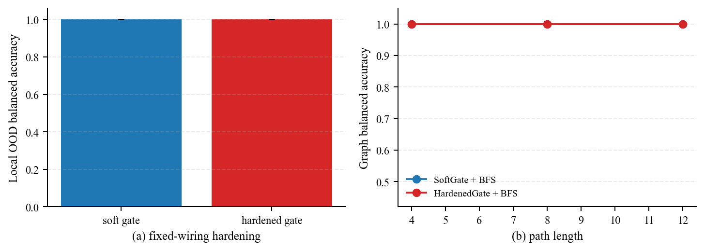
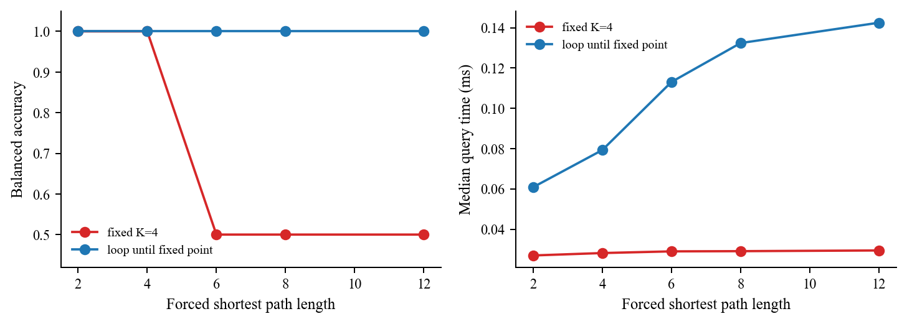
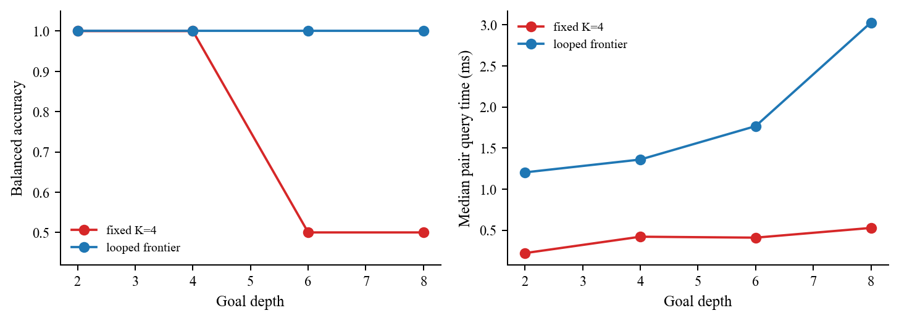
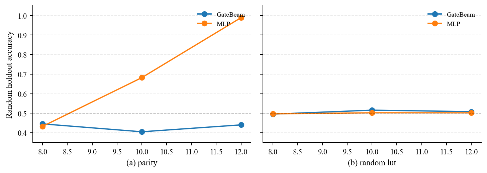
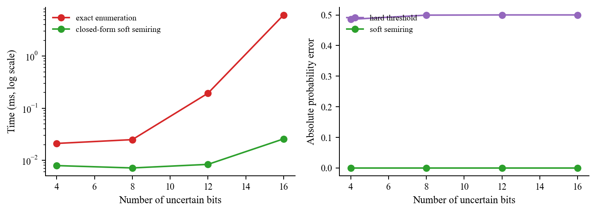
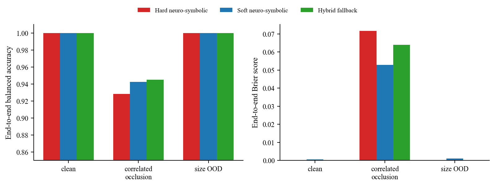
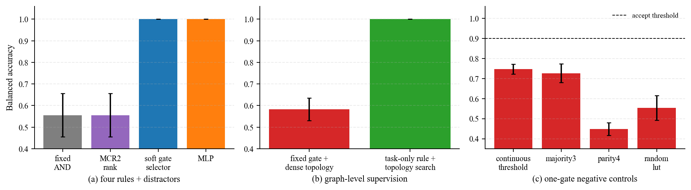
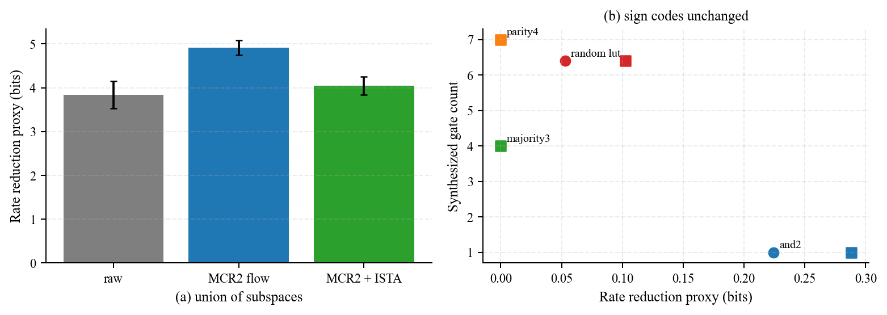

# 逻辑门作为 Neuro-Symbolic AI 局部编译层：证据报告

## 结论先行

当前证据支持一个有边界的结论：逻辑门适合放在

```text
encoder / LLM proposal
    -> named predicates (+ uncertainty)
    -> learned or compiled Boolean gate DAG
    -> BFS / Datalog / SAT / planner / verifier
```

中，承担重复调用、局部组合、候选过滤和可编译的 bit-level 计算。它不适合替代递归、proof search、规划、概率边缘化或感知模型。

本轮补做了两个此前缺失的闭环实验：

1. `SoftGateCircuit` 是一个固定 wiring 的可微门混合代理。它先学习 AND/OR/XOR/NAND 的 softmax 权重，再把每个节点 argmax 编译成硬门，测量 soft→hard 的端到端掉点。
2. 将同一个 learned gate 接入分层图 BFS，分别测量 `LearnedSoftGate+BFS` 和 `LearnedHardenedGate+BFS`，而不是只报告 oracle 局部谓词。

这些结果证明“接口可以兼容”，但只在局部规则可压缩、谓词已经二值化或带可靠置信度、以及后端 solver 保留为独立模块时成立。

## 1. 局部规则学习与 soft→hard 闭环

原有 GateBeam 是透明的 bit-packed 结构搜索代理，不是某个发表的 DLGN/Conv-DLGN 复现。在 8-bit 可组合规则、50% 训练覆盖、10 个划分上，GateBeam 的 OOD 平衡准确率为 `1.000 ± 0.000`，小 MLP 为 `0.823 ± 0.104`；随机 LUT 对照中 GateBeam 只有 `0.518 ± 0.170`。该对照与“可压缩组合结构有助于跨未见组合泛化，而随机标签没有这种结构”的解释一致，但不是因果识别，也不是对某个 sampled LUT 的电路下界。GateBeam 的小真值表拟合约 `0.7–0.8 s`，高于小 MLP 的约 `0.20–0.22 s`，动态规则或频繁更新时这项编译成本可能抵消部署收益。

新增的 learned soft-gate 结果（`results/learned_gate_results.csv`）如下：

| 训练覆盖 | 方法 | 全表平衡准确率 | OOD 平衡准确率 | OOD Brier | soft→hard OOD 掉点 | 拟合时间 |
|---:|---|---:|---:|---:|---:|---:|
| 50% | LearnedSoftGate | 1.000 ± 0.000 | 1.000 ± 0.000 | 0.000015 ± 0.000003 | — | 0.440 ± 0.024 s |
| 50% | LearnedHardenedGate | 1.000 ± 0.000 | 1.000 ± 0.000 | 0 | **0.000** | 0.440 ± 0.024 s |
| 75% | LearnedSoftGate | 1.000 ± 0.000 | 1.000 ± 0.000 | 0.000017 ± 0.000002 | — | 0.498 ± 0.019 s |
| 75% | LearnedHardenedGate | 1.000 ± 0.000 | 1.000 ± 0.000 | 0 | **0.000** | 0.498 ± 0.019 s |

10 个 seed 中硬化电路都保持了 soft 输出的 OOD 分类结果；不同 seed 可能学到等价的门表达式，例如 `NAND NAND XOR NAND OR NAND AND`，所以不能把某一组门名当成唯一真值结构。这个实验是**固定 wiring 的 controlled proxy**：它验证 operator learning 和 argmax hardening 的接口，不等价于对任意 learned-LGN 结构搜索的证明。

## 2. learned-Gate+BFS：输入输出是否能融合

每个图边仍以 8 个 named predicates 输入；gate 输出边有效性的概率/bit；BFS 只负责全局递归。图的宽度为 8、16、32，路径长度为 4、8、12，每个条件 60 个图、每个训练覆盖 10 个 seed。结果在 `results/learned_gate_bfs_results.csv`：

| 训练覆盖 | 方法 | 平衡准确率 | 正例准确率 | 负例准确率 | 各条件查询中位数的均值 |
|---:|---|---:|---:|---:|---:|
| 50% | LearnedSoftGate+BFS | 1.000 ± 0.000 | 1.000 | 1.000 | 0.051 ms* |
| 50% | LearnedHardenedGate+BFS | 1.000 ± 0.000 | 1.000 | 1.000 | 0.044 ms* |
| 75% | LearnedSoftGate+BFS | 1.000 ± 0.000 | 1.000 | 1.000 | 0.051 ms* |
| 75% | LearnedHardenedGate+BFS | 1.000 ± 0.000 | 1.000 | 1.000 | 0.043 ms* |

`*` 只计时预计算边之后的 BFS 查询；门推理、输入布局和 pack/unpack 不在该列内。



在这个合成分布中，soft gate 先以 `p>=0.5` 生成边，hardened gate 直接用编译后的 Boolean DAG；两者都在 4/8/12 层保持完美图级结果。它补足了此前“oracle gate + BFS”证据，但仍不能推出真实感知误差下的端到端无损：图边特征来自已知的 8-bit 合成谓词，soft BFS 也使用了阈值化边，而不是概率路径边缘化。

固定深度反例仍然成立：`FixedK=4GateCircuit` 在长度大于 4 时平衡准确率为 0.5、正例准确率为 0；oracle 局部谓词加 BFS 在长度 2–12、宽度 8–32 的 30 个独立条件上为 1.0。因此门层和全局 solver 的职责必须分开。

## 3. 计算效率与真正瓶颈

在 `2^20 = 1,048,576` 个样本上，CPU/NumPy 测量为：

| 路径 | 中位时间 | 显式输入/活动 buffer | 相对 float t-norm |
|---|---:|---:|---:|
| float t-norm | 30.51 ms | 33.55 / 34.60 MB | 1.0× |
| NumPy bool | 7.09 ms | 8.39 / 9.44 MB | 4.31× |
| 预打包门内核 | 0.429 ms | 1.05 / 1.18 MB | 71.2× |
| pack + kernel + unpack | 9.94 ms | 8.39 / 10.62 MB | 3.07× |

因此“离散、稀疏、可编译”在重复查询内核上成立，但端到端优势只有约 3.07×；pack/unpack、缓存驻留和调用次数是接口成本。关系过滤也说明只把每个 pair 换成门并不会消除组合爆炸：`N=2048` 时索引候选只检查 `0.0373%` 的 pair，dense/index 平均为 `21.64/3.06 ms`，约快 7.08×；小 `N` 时 Python 索引开销反而可能更慢。真正需要和门一起设计的是候选生成、数据布局和内存驻留。

训练/编译与部署的瓶颈是不同的：GateBeam 在小表上的结构搜索约 0.7–0.8 s，learned soft-gate 代理约 0.44–0.50 s；部署后硬门只需微秒级局部查询。若规则频繁更新，编译时间可能成为主导；若规则固定且重复调用，编译摊销后 bit-pack 和候选生成才是主要接口成本；递归、proof search、规划和概率推理仍然是全局复杂度来源。

## 4. grounding 风险与 hardening 条件

独立 bit-flip 率为 0.20 时，原有局部实验的分类准确率 hard/soft 都约为 `0.694`，但 Brier score 分别为 `0.306 ± 0.002` 和 `0.204 ± 0.001`。局部 Boolean 组合会传播 grounding bit error；hardening 在该对照中没有进一步降低分类准确率，但会额外丢弃概率信息和校准，soft 概率电路保留了更多后验信息。因而 hardening 只有在谓词已高置信二值化、误差代价可接受，或系统能把低置信输入回退给概率模块/solver 时才合适。

## 5. 回答“兼容吗、能否近乎无损、是否是瓶颈”

- **兼容性：** 兼容的是 `named predicates → local gate → solver` 接口，而不是把整个 neuro-symbolic 系统硬化成一个电路。新增 learned-Gate+BFS 在合成 clean 输入上验证了这条接口。
- **近乎无损：** 在有限、可压缩、高置信的局部规则上，本轮 soft→hard OOD 掉点为 0，图级 soft/hard BFS 也均为 1.0；这不能外推到随机 LUT、噪声 grounding、概率推理或动态规则。
- **瓶颈：** 不是单一瓶颈。静态部署的瓶颈转向输入 pack/unpack、索引/候选生成和全局 solver；动态系统的瓶颈可能回到 GateBeam/soft-gate 的训练与编译；不确定 grounding 下最明显的系统风险是 hard gate 的错误传播。

## 6. 证据边界与复现

本项目仍是合成 CPU/NumPy 研究原型：视觉证据现已覆盖 rendered gridworld 的像素到任务输出闭环，但不覆盖自然图像、语言 grounding、FPGA/ASIC PPA、真实 DLGN 训练复现或精确概率路径边缘化。learned-Gate+BFS 的旧计时不包含门推理和数据布局；新增 gridworld 结果则分别记录 encoder 与 solver 时间。`SoftGateCircuit` 是固定 wiring 代理，规划 frontier 也是单调搜索代理，避免把它们误称为通用 LGN 或完整 solver。原始输入哈希、环境、CSV 和图表见 [provenance.md](provenance.md)、`results/` 和 `figures/`；完整工程见 [README](../README.md)。

## 7. 不可压缩规则与一般硬件计算

“不可压缩”不是门库不够大，而是目标函数本身没有可复用的短描述。对任意 `n` 位 Boolean 函数，真值表需要 `2^n` 位；存在函数的最小电路规模随 `n` 指数增长。此时硬件仍然可以高效执行，但优化目标变成**并行度、带宽、存储层次和吞吐**，不是把规则编译成很小的 DAG。

| 工作负载 | 更合适的硬件机制 | 逻辑门能承担的部分 | 不能消除的部分 |
|---|---|---|---|
| 不可压缩 Boolean/LUT | ROM/LUT、bit-slicing、SIMD、流式查表 | 位运算、地址译码、批量比较 | 表容量和带宽仍近似随 `2^n` 增长 |
| 遍历/递归闭包 | frontier bitset、稀疏矩阵乘、队列、状态寄存器 | 邻接谓词、mask、去重 | 循环次数、队列容量、动态终止 |
| proof search/SAT/SMT | clause database、watch lists、分支控制、学习子句 | 冲突检查、位掩码、局部传播 | 分支树和内存不规则访问 |
| 规划 | 并行 successor expansion、heuristic cache、开放/关闭表 | 状态合法性和动作约束 | 状态空间、启发式误差和搜索宽度 |
| 概率边缘化/WMC | semiring/tensor contraction、知识编译、采样或变分近似 | 局部因子组合和稀疏零检测 | 精确求和通常是指数或 #P-hard |
| 感知模型 | systolic array、tensor core、低比特量化、结构/非结构稀疏 | 量化比较、稀疏 mask、后处理约束 | 浮点/定点乘加、权重搬运和表示误差 |

因此高效硬件通常不是“所有模块都改成逻辑门”，而是 `gate datapath + state/control + memory + numeric engine` 的异构组合。

## 8. 循环门电路与状态转换是否能替代递归

可以，但需要把门从无状态 DAG 扩展为带寄存器和控制器的转移系统：

```text
s[t+1] = F(s[t], input[t])
frontier[t+1] = T(frontier[t]) & ~visited[t]
visited[t+1] = visited[t] | frontier[t+1]
```

这类设计能表达变长遍历、循环图闭包和有限状态程序。它把“深度”换成“时钟周期”，把“递归栈”换成片上 RAM/队列或外存。若允许无界内存和无界时间，门加状态转换可以模拟通用计算；但有限硬件只能实现有限状态机，仍受状态容量、循环次数、带宽和终止条件限制。

新增的 `state_transition_results.csv` 对循环图做了直接对照：

| 方法 | 路径长度 ≤4 | 路径长度 >4 | 平均查询时间 |
|---|---:|---:|---:|
| FixedK=4StateUnroll | 1.0 | 0.5 | 0.028 ms |
| LoopedStateTransition | 1.0 | **1.0** | 0.101 ms |



表中时间是跨可用 width 条件的简单均值；循环机制恢复了固定展开失去的表达能力，但查询时间约为固定展开的 3.5 倍。这不是失败，而是用动态迭代和状态存储换取了变长计算能力。对 proof search 和规划，循环状态机还需要分支、队列、回溯和启发式模块，不能只靠一个 `F` 门网络。

这里的两个查询时间是 Python/NumPy 原型中的状态遍历时间，不是固定组合门、FPGA LUT 或 ASIC PPA 的测量；每个 query 都重新执行闭包，适合比较控制流语义，不适合直接外推硬件吞吐。

`planning_frontier_results.csv` 给出了一个更直接的规划/证明前沿代理：状态是待满足的 Boolean 条件，动作一次设置一个合法 bit，另有一个被阻塞的 bit 形成负例。固定 K=4 在 goal depth 2/4 上平衡准确率为 1.0，在 depth 6/8 上降为 0.5；循环 frontier 在所有深度均为 1.0。跨可用 `n_bits` 的全量平均 pair 查询时间分别为 `0.382 ms` 和 `1.732 ms`，循环版本约慢 4.5×，并且平均扩展状态数从 262 增至 1,357。



这是单调状态空间的 planning/proof-search **代理**，不是完整 planner、SAT、SMT 或带启发式回溯的证明器；它验证的是控制流和状态存储的必要性，而不是某个求解器的硬件 PPA。

## 9. 表示困难、搜索困难和概率边缘化

`noncompressible_scaling_results.csv` 测量了随机 LUT 与 parity 随位宽增加的行为。GateBeam 的随机 holdout 准确率在 8/10/12 位分别为 `0.495/0.516/0.508`；这些 sampled LUT 没有组合泛化，但这不是每个样本实例的电路下界。Parity 则有明确的 XAG 构造：`n` 位 parity 用 `n-1` 个 XOR，平衡树在 8/10/12 位的深度为 3/4/4。现有 GateBeam 已含 XOR 且 `max_depth=4` 足够，却仍只有 `0.445/0.405/0.440`；该结果与局部 accuracy 排序、`beam_width=192` 剪枝造成的 **search/objective bias** 一致，但当前没有保存 search trace，也没有做 beam-width/ranking ablation，因此不能把具体失败机制视为已定位。这至少排除了“basis 中没有 XOR”和“该构造必然超过深度上限”两种解释，也不能把失败解释为表示不可压缩。两类负结果必须分开。

`probability_marginalization_results.csv` 进一步区分了三件事：

- 对独立 Bernoulli parity，精确枚举与 closed-form soft semiring 的误差为 0；但枚举时间从 4 位的约 `0.021 ms` 增长到 16 位的约 `6.153 ms`。
- 对同一不确定输入的 `x AND x` 或 `x OR x`，把两条线当成独立变量会产生约 `0.201` 的平均概率误差，说明局部 soft gate 只有在独立性、可分解性或共享变量被显式处理时才保持精确。
- 先把每个输入硬阈值化再计算 parity，和真实事件概率的绝对误差约为 `0.5`；hard 输出是一个类别，不是边缘概率。





## 10. soft 到 hard 的根本障碍

即使暂时“不计代价”，soft→hard 仍有语义障碍：

1. **期望与阈值不交换。** 一般有 `H(E[f(X)]) != E[f(H(X))]`。soft 模块表示分布或置信度，hard 模块只保留一个赋值。
2. **相关性不局部可见。** 共享变量、循环状态和 proof branches 让局部概率不再独立；逐门乘法会错误地重复计算同一不确定性。
3. **搜索需要保留多个分支。** soft 权重可以同时保留候选；hard argmax 只选一条路径，可能在后续约束下才发现错误，却无法恢复被丢弃的分支。
4. **动态深度不是固定结构。** 递归、规划和证明的停止时间依赖输入；固定 hard DAG 必须预先给出最大深度，循环版本则需要状态、计数器、队列和终止检测。
5. **感知表示不是 Boolean 语义。** 量化或二值化会把相近但有意义的实数表示折叠到同一 bit；分布外输入还可能放大阈值附近的小误差。

所以“不计门成本”只能说明门加状态在计算表达能力上足够强，不能说明它保留了概率语义、搜索完整性或感知精度。

## 11. 设计建议与范围边界

推荐的硬件/系统分层是：

```text
perception numeric engine
  -> calibrated uncertain predicates
  -> packed local gate datapath
  -> state/control engine (loop, queue, stack, counter)
  -> solver-specific memory and arithmetic
```

门适合做局部合法性检查、mask、冲突检测、关系候选过滤和重复 bit-level kernel；状态转换适合承载变长遍历；proof search、规划和概率推理需要专门的控制、内存和数值单元。当前实验验证了随机规则、循环状态、概率语义和 rendered gridworld 视觉闭环，但没有声称已经测量真实 FPGA/ASIC PPA、完整 SAT/SMT、通用规划器或自然视觉模型。`reports/references.md` 和 `reports/provenance.md` 记录了理论来源、输入哈希和运行环境。

## 12. 像素到符号求解器的端到端 Gridworld

新增模型位于 `src/neurosymbolic_gridworld.py`，完整推理路径为：

```text
rendered RGB grid image
  -> patch MLP encoder
  -> temperature-scaled free/wall/source/target predicates
  -> learned soft edge gate -> argmax hardened gate
  -> hard BFS / soft max-product reachability
  -> confidence-routed fallback
  -> reachability verifier
```

训练集是 8×8 gridworld，每个 cell 由 4×4 RGB 像素组成，包含颜色扰动和像素噪声。测试包含 clean 8×8、相关矩形遮挡，以及未在训练中出现的 10×10 尺寸。神经 encoder 使用 cell-level concept supervision；edge gate 从预测的 passability probability 和真实边标签学习，在三个 seed 中均 harden 为 `AND`。候选图仍由四邻接拓扑产生，因此这不是 learned sparse router。

全量三 seed 结果见 `results/end_to_end_gridworld_results.csv`：

| 条件 | Hard | Soft | Hybrid fallback | Cell grounding | Hybrid fallback rate |
|---|---:|---:|---:|---:|---:|
| clean 8×8 | 1.000 ± 0.000 | 1.000 ± 0.000 | 1.000 ± 0.000 | 1.000 | 0.000 |
| correlated occlusion 8×8 | 0.928 ± 0.023 | 0.959 ± 0.019 | **0.963 ± 0.016** | 0.980 | 0.131 |
| size OOD 10×10 | 1.000 ± 0.000 | 1.000 ± 0.000 | 1.000 ± 0.000 | 1.000 | 0.000 |



相关遮挡下，hard pipeline 的 Brier 为 `0.0717 ± 0.0227`，soft pipeline 为 `0.0665 ± 0.0221`，hybrid 为 `0.0702 ± 0.0227`。Hybrid 的任务准确率最高，而 soft 的 max-product path score 在该测试集上的 Brier 更低；该 score 不是精确 reachability probability，不能据此宣称一般概率校准成立。相关遮挡下 cell grounding ECE 为 `0.0182 ± 0.0021`，source localization 为 `0.983 ± 0.009`、target localization 为 `0.999 ± 0.001`；任务错误与局部 wall/free grounding 和路径连通性放大一致。三个种子的最优温度均达到候选网格下界 `0.08`；soft threshold 为 `1.27e-4/1.27e-4/2.59e-4`，接近 `1e-4` 下界；confidence threshold 为 `0.10/0.456/0.120`，其中一个种子达到 `0.10` 下界。因此这里只能证明当前验证搜索下的观测结果，不能证明校准或 Hybrid 策略超参数已经被充分识别。

延迟拆分避免把同一求解时间复制给不同方法。在 8×8 clean 条件下，已计时的 MLP 编码器核心为 `0.029 ms/image`，hard、soft、hybrid 求解器核心分别为 `0.034/0.102/0.034 ms/image`；在 10×10 size OOD 下分别为编码器核心 `0.047 ms/image`、求解器核心 `0.052/0.136/0.052 ms/image`。这说明当前 NumPy 原型里 soft 路径传播核心比 hard BFS 慢约 3 倍；本实验支持的是鲁棒性收益而非 soft 计算加速。

这些延迟是 NumPy 原型的组件核心计时，不含 patch 提取、source/target argmax、gate 推理及接口成本，不能相加冒充完整端到端延迟，也不是神经网络加速器或硬件 PPA。

这项实验完成了**原始像素输入到符号任务输出的推理闭环**，但仍有三条明确边界：encoder 与 gate 使用中间标签监督，而不是只用最终任务损失训练；四邻接候选拓扑由程序给出；learned gate 只导出 NumPy hard operator，尚未自动生成 packed C、AIG 或 RTL。模型权重与 gate IR 保存在 `results/gridworld_models/`，运行元数据包含源码哈希和运行开始时的 Git 状态。

## 13. 从“恢复 AND”到逻辑发现

为避免把预设 AND 的恢复误写成一般逻辑学习，`logic_discovery_results.csv` 加入了五种子受控实验。可微选择器在 8 个输入中的 28 个无序 pair 与 AND/OR/XOR/NAND 四个算子上建立 softmax，共 112 个候选；训练后只 harden 一个候选。

| 方法 | 四规则+distractor 平衡准确率 | 算子恢复 | 输入 pair 恢复 | 描述成本 |
|---|---:|---:|---:|---:|
| Fixed AND | 0.556 ± 0.100 | 不适用 | 不适用 | 2 bits（仅算子） |
| 仅 MCR² 排序 | 0.556 ± 0.100 | 0.25 | 0.05 | 7 bits |
| Differentiable gate selector | **1.000 ± 0.000** | **1.00** | **1.00** | 7 bits |
| TinyMLP | **1.000 ± 0.000** | 不可直接抽取 | 不可直接抽取 | 10,304 parameter bits |

这里的 7 bits 是固定长索引成本：从 28 个 pair 中选一个，再从 4 个算子中选一个；MLP 的 10,304 bits 是 161 个 NumPy `float64` 权重和 bias 的实际数组 payload，只是显式存储量对照，不是熵编码或硬件面积。最新 clean full run 中，可微选择器、仅 MCR² 排序和 MLP 的平均拟合/搜索时间分别为 `0.0261/0.0104/0.0662 s`。在 210 服务器的 1,000-row NumPy batch 上，固定 AND、已 harden 的可微选择器和 MLP 的 per-run median 均值分别为 `1.70/4.37/70.68 μs`；这些是固定单线程环境下的 Python/NumPy 原型 kernel timing，不含数据搬运，也不能外推 ASIC/FPGA PPA。

只在 depth-1 上学习四个算子的身份，再无训练地组合到 depth-2/3，真值表准确率均为 1.0。这说明已学会的 primitive 可以系统组合，但组合树仍由程序给出，因此不是未见结构发现。更强的 task-only 测试不给 edge label，只给图级 reachability；有限搜索同时选择输入 pair、算子和四类候选关系的 topology mask，五个种子在测试集上均为 1.0，并全部恢复隐藏规则与 mask；固定 AND+dense topology 只有 `0.583 ± 0.052`。该有限枚举搜索平均用时 `7.04 s`，这里学习的是有限关系类型 mask，不是任意对象图或连续 sparse router。

负例的拒绝只看独立 validation split，不读取 test 指标；当 validation 平衡准确率低于 `0.90` 时 abstain。五个种子均拒绝了 majority-3、parity-4、random LUT 和连续阈值的一门近似；四者 test 平衡准确率分别为 `0.726/0.448/0.554/0.747`。概率乘积是另一种语义负例：soft AND 的 MSE 为 0，hardened AND 为 `0.0825`，说明“同一个算子名称”不保证 hard 输出保留概率值。



这些结果把结论推进到“在有限候选库内能学习变量绑定、算子和关系类型”，但仍没有覆盖任意 learned wiring、从自然图像只靠任务损失发现谓词、或自动综合深层最小电路。

## 14. MCR²、ReduNet/CRATE 代理与 Booleanization

MCR² 对有限样本矩阵 $Z\in\mathbb{R}^{d\times m}$ 使用带精度参数的高斯 log-det 代理：

\[
R_\epsilon(Z)=\frac{1}{2}\log_2\det\left(I+\frac{d}{m\epsilon^2}ZZ^\top\right),\qquad
\Delta R=R_\epsilon(Z)-\sum_j\frac{m_j}{m}R_\epsilon(Z_j).
\]

`rate_logic_experiments.py` 实现了这个目标、解析梯度、有限差分回归测试以及重复梯度层；每层可选接一个 ISTA soft-threshold。它复现的是 MCR²/ReduNet 的核心目标与展开思想，不是官方 ReduNet 或 CRATE 训练栈。MCR² 原论文、ReduNet、MCR² 变分加速与 CRATE 的一手来源列在 `reports/references.md` 的 19–23 项。

三类合成子空间上的五种子结果为：

| 表示 | ΔR proxy (bits) | 零元素比例 | 子空间相干性 | 经验码字熵 | 线性重建 MSE |
|---|---:|---:|---:|---:|---:|
| Raw | 3.838 ± 0.308 | 0.000 | 0.862 | 7.119 | 0.0148 |
| MCR² flow | **4.916 ± 0.173** | 0.000 | **0.670** | 7.074 | 0.0145 |
| MCR² flow + ISTA | 4.051 ± 0.209 | **0.465** | 0.755 | **6.631** | 0.0219 |

纯 MCR² 更新提高了 rate reduction 并降低类子空间相干性；ISTA 获得 46.5% 精确零和更低经验码字熵，但牺牲了部分 ΔR 并增加重建误差。这支持“压缩/线性化与稀疏化可由迭代目标组织”的受控版本，也直接显示多个目标之间存在 Pareto trade-off，并非一个项自动同时最优。

CRATE-style 共享投影代理把每个子空间基 $U_k$ 同时用于 $U_k^\top Z$ 的分析投影与 $U_k(\cdot)$ 的合成映射。在 `d=12`、3 heads、每 head 4 维的记账中，共享基有 144 个参数，独立 Q/K/V 投影为 432 个，比例为 1/3；这不含标准 attention 的输出投影、bias、归一化或任务精度，也不能推出任意 Transformer 都能无损共享 Q/K/V。

### 14.1 为什么不能直接从 ΔR 推到 bit 数或门数

公式使用 `log2`，所以数值单位可写为 bits；但它是给定高斯/子空间近似、有限样本与失真尺度 $\epsilon$ 的**码率代理**，不是某个实际 codec 生成的 prefix-code 长度。真实 bit 成本还依赖量化器、码本、概率模型、有限精度、解码器和元数据。一般率失真求解困难，也不能因为这个近似可计算就把它解释为任意分布的精确率失真函数。

Boolean 对照给出更直接的反例：MCR² flow 后四类任务的 sign-flip rate 全为 0，经验码字熵保持 8 bits，GateBeam 表达式与门数也逐任务完全不变；AND-2 的 ΔR 却从 0.224 增到 0.288，random LUT 从 0.0528 增到 0.1025。也就是说，连续代理改善时，二值码与门电路可以一位不变。

更强的失败来自“仅用 MCR² 选一门”。对于本实验的标量行向量 $z\in\{-1,+1\}^{1\times m}$，未中心化二阶项满足 $zz^\top=m$，等价地 $(1/m)zz^\top=1$，因此丢掉符号；所有候选单门的 ΔR 均为 0。不允许用准确率偷偷打破平局时，它退化为固定选择，结果与 Fixed AND 同为 0.556。原始 MCR² 因而不能单独识别 AND/OR/XOR/NAND 的 Boolean 真值语义。



### 14.2 可检验的 Boolean-aware 扩展

若要让率缩减真正引导门化，目标中必须显式加入 Boolean 语义和实现成本，而不是把 ΔR 当门数替身。例如可测试：

\[
\mathcal{J}=\mathcal{L}_{task}-\lambda\Delta R_\epsilon(Z;\Pi)
+\beta\lVert Z\rVert_1+\tau H(q)
+\gamma\sum_h q_h C_{gate}(h)+\eta D(X,\hat X),
\]

其中 $q_h$ 是候选 wiring/operator 的分布，$H(q)$ 推动可硬化选择，$C_{gate}$ 是按目标库定义的门/LUT/线网成本，$D$ 约束有限精度解码失真。对于 Boolean 表示，还需要能区分符号、联合赋值和高阶相关性的统计量，例如离散码字交叉熵、可学习 Bernoulli/Ising codec、truth-table MDL 或直接的 AIG/LUT 综合成本。当前实验验证了原始 MCR² 的几何作用及其符号盲区；上式是下一阶段设计，不是已验证结果。

### 14.3 已执行的离散扩展

上述设计中的 Boolean-aware 部分现已落实为一套独立的 Boolean/Circuit-MDL 实验：KT 与 joint Dirichlet 表示码、对称的标签 side-information 记账、带 escape 的非负路由、可译码的模型与组合残差码，以及固定门基下四输入全部函数的精确最小公式树 catalog。完整定义、证明、12,870 个平衡函数的分布、六输入结构化规则与 random-LUT 路由结果见 [`reports/discrete_theory_zh.md`](discrete_theory_zh.md)。这项扩展建立的是**相对于公开元语言的离散描述长度**，仍不把码长解释成语言无关熵，也不把最小公式树解释成最小 DAG 或硬件 PPA。

## 15. Basis-aware 归纳偏置更新

最新三输入 256×4 exact formula oracle、AIG/XAG/MIG-style 任务分化、付费 witness-code、parity 表示/搜索分离，以及外部 Hard-LGN hardening/ABC 审计，统一整理在 [`reports/inductive_bias_update_zh.md`](inductive_bias_update_zh.md)。当前最有证据支持的下一步不是固定一种门基，而是预先声明并付费的层级 representation/basis mixture；这仍是 proposed design，尚未成为部分样本上的联合 learner。
