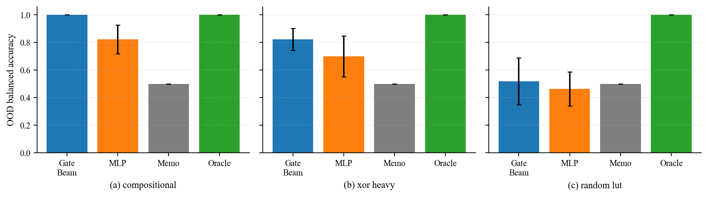
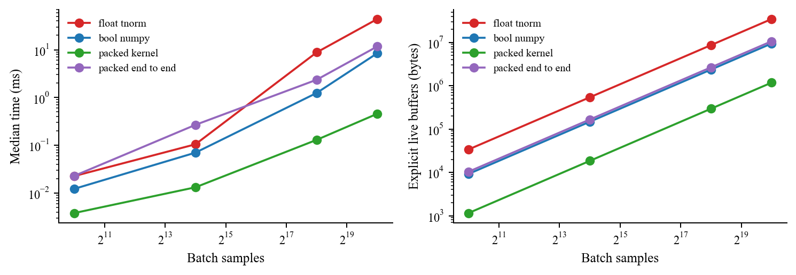
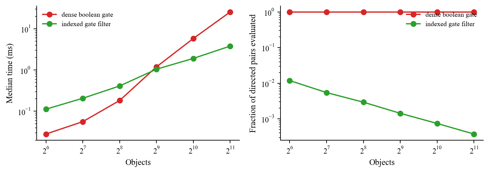
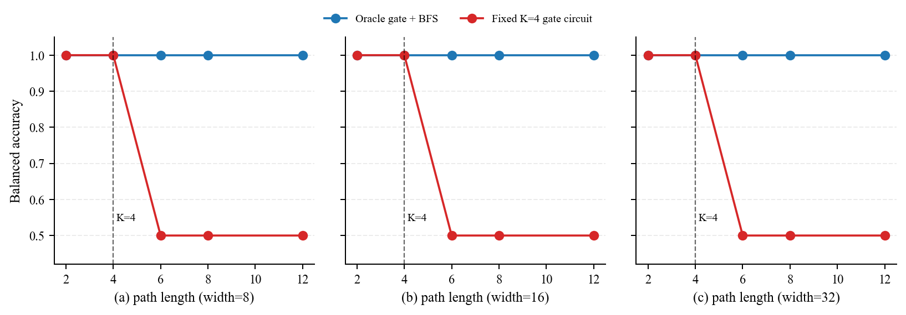
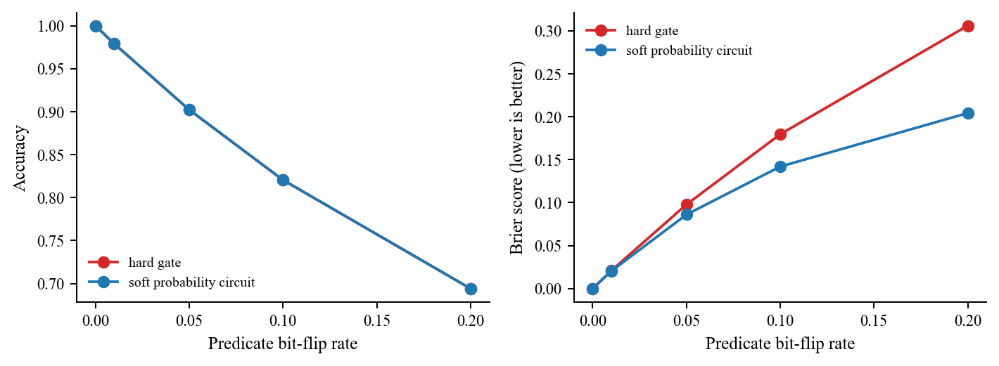

# 逻辑门用于符号 AI：可验证的局部编译层，而非完整推理器

## 结论

本项目支持一个有边界的结论：**逻辑门网络适合作为神经符号系统中有限、局部、重复执行的谓词组合器、关系过滤器和硬约束验证器；它不应被当作通用符号推理器。**

在可压缩的 8-bit 局部规则上，GateBeam 在 50% 中间汉明重量样本训练时的 OOD 平衡准确率为 **1.000 ± 0.000**（10 个数据划分），而小 MLP 为 **0.823 ± 0.104**。但在随机 LUT 负对照上，GateBeam 的 OOD 平衡准确率为 **0.519 ± 0.170**，没有稳定泛化优势。收益来自可组合、可压缩的规则结构，而不是“布尔门”这一表示形式本身。

另一条构造性负证据是：固定 (K=4) 的 AND/OR 可达性电路在路径长度大于 4 时正例准确率为 0、平衡准确率为 0.5；把 **oracle 局部边谓词**交给 BFS 后，在长度 2–12、宽度 8–32 的所有条件上均为 1.0。这是局部逻辑与递归求解器分工的证据，不是 learned-LGN 端到端泛化的证明。

原始 CSV、可再生图表、代码和来源记录均在本仓库；环境与输入文档哈希见 [provenance.md](provenance.md)。

## 1. 从参考文档到可证伪命题

两份参考文档一致建议把 LGN 放在以下中间位置，而不是把它等同于完整 symbolic reasoner：

```text
encoder -> named predicates -> LGN / Boolean DAG -> solver / planner / verifier
```

由此形成四个实验问题：

1. 局部布尔规则能否从不完整样本中恢复，并外推到未见组合？
2. harden/bit-pack 后是否有真实推理成本收益？
3. 门网络能否承担递归、长链搜索？
4. grounding 噪声和不确定性在硬化后会造成什么损失？

本项目不包含原始图像/文本的端到端 grounding，也不把 CPU 原型外推为 FPGA/ASIC PPA。

## 2. 当前符号 AI 发展与计算低效

截至 2026-07-11，较稳定的路线是分层组合：神经模型负责感知、候选生成或搜索启发；符号系统负责精确求解、验证和反馈。DeepProbLog/Scallop 把神经谓词与概率或 Datalog 推理结合；Logic-LM、AlphaGeometry/AlphaGeometry2 则让神经或语言模块生成形式化候选，再由 solver/prover 执行或验证。原始来源见 [references.md](references.md)。

| 层次 | 常见实现 | 低效或风险 | 逻辑门可承担的部分 |
|---|---|---|---|
| 局部谓词组合 | MLP、fuzzy t-norm、soft attention | 最终仅需 AND/OR/XOR/NOT 时仍保留浮点计算 | 可学习/编译的局部 Boolean DAG |
| 有界量词和匹配 | dense aggregation | 大量最终无效对象对、匹配项 | bitset 归约、XNOR/LUT、候选过滤 |
| 关系推理 | (N^2/N^3) grounding 张量 | 元数带来组合膨胀 | 必须结合索引/候选生成才会减少 pair 数 |
| 概率证明/模型计数 | proof 枚举、WMC | #P 难度；低概率候选仍可能重要 | 可编译反复出现的局部 proof 片段，不替换整体概率推理 |
| 递归/规划/定理证明 | fixpoint、图搜索、SAT/ASP/prover | 搜索预算和状态空间 | 前置过滤、状态合法性检查；搜索仍交给 solver |

逻辑门并不自动保证可处理性。知识编译所需的 decomposability、determinism、smoothness 等额外结构不会因为网络“由门组成”而自然出现；SAT、#SAT、一般编译大小和任意布尔函数电路规模的最坏情况障碍也不会消失。

## 3. 实验设计

### 3.1 局部谓词学习

输入为八个命名二值谓词：`near, same_color, aligned, same_shape, src_active, dst_active, blocked, reserved`。目标规则为：

```text
((near AND same_color) OR (aligned AND same_shape) OR
 (src_active XOR dst_active)) AND NOT(blocked AND reserved)
```

全部 (2^8=256) 个赋值可枚举。训练仅从汉明重量 2–6 取样；重量 ≤1 或 ≥7 的赋值为组合 OOD。比较方法：

- **GateBeam**：从 `AND/OR/XOR/NAND` 库进行 bit-packed beam search，输出可读 Boolean DAG；它是透明的规则归纳原型，**不是**论文 DLGN 的逐字复现。
- **MLP**：24–16 隐层的全浮点基线。
- **TruthMemorizer**：已见赋值查表，未见赋值回退为训练先验。
- **OracleRule**：已知规则，仅作语义上界，不计为学习结果。

另用 XOR-heavy 规则检查门库影响，用平衡随机 LUT 作为不可压缩负对照。每个学习单元使用 10 个配对随机划分；全部单次结果、TPR/TNR、F1 和 MCC 在 `results/predicate_results.csv`。

### 3.2 编译执行、关系过滤、递归与噪声

同一规则在 (2^{10}) 至 (2^{20}) 样本的 batch 上比较 float t-norm、NumPy bool、预打包 byte-lane kernel、以及包含 pack/unpack 的端到端路径。CSV 将预打包常驻输入与从 byte 输入开始的显式转换 buffer 分开记录。

关系过滤使用 `same_color AND different_shape AND within_window`，比较 dense (N(N-1)) 枚举和按颜色/位置 bin 的 indexed candidate generation。这样可分开评估逻辑表示与候选生成的收益。

分层图中边由 oracle 局部规则决定；比较 `OracleGate+BFS` 与固定 (K=4) 的 Boolean unrolling。每张图显式生成一个正例终点和一个不可达终点。噪声实验对真实谓词施加独立 bit flip；hard gate 用翻转后 bit，soft probability circuit 用已知翻转率形成后验并计算规则概率。

## 4. 实验结果

### 4.1 可压缩性决定局部 OOD 泛化

下表为 50% 训练分数的 OOD **平衡准确率**（均值 ± 样本标准差，10 个划分）。

| 规则族 | GateBeam | MLP | TruthMemorizer | 解释 |
|---|---:|---:|---:|---|
| compositional | **1.000 ± 0.000** | 0.823 ± 0.104 | 0.500 ± 0.000 | Gate library 与局部组合结构匹配；9/10 次完整真值表完全恢复。 |
| XOR-heavy | **0.823 ± 0.081** | 0.699 ± 0.149 | 0.500 ± 0.000 | XOR 门有帮助，但 GateBeam 不是万能学习器；75% 训练时 MLP 的 OOD 平衡准确率为 0.919 ± 0.121，高于 GateBeam 的 0.818 ± 0.091。 |
| random LUT | 0.519 ± 0.170 | 0.464 ± 0.124 | 0.500 ± 0.000 | 不可压缩目标上没有稳定结构泛化，反驳“门电路天然泛化”的强说法。 |



当 compositional 规则训练分数提高到 75% 时，GateBeam 10/10 次恢复完整 256 行真值表，平均 11.0 个二输入门。25% 训练时仅 3/10 次完整恢复，OOD 平衡准确率为 (0.909 pm 0.116)，说明结构先验仍需要足够覆盖；它不是无数据的符号发现。

### 4.2 bit-packing 的内核收益与端到端代价

在 (2^{20}=1,048,576) 个样本上：

| 方法 | 中位时间 | 源输入 / 显式活跃 buffer | 相对 float t-norm |
|---|---:|---:|---:|
| float t-norm | 43.97 ms | 33.55 / 34.60 MB | 1.0× |
| NumPy bool | 8.45 ms | 8.39 / 9.44 MB | 5.20× |
| 预打包门内核 | **0.456 ms** | **1.05 / 1.18 MB** | **96.4×** |
| pack + kernel + unpack | 11.72 ms | 8.39 / 10.62 MB | 3.75× |



预打包 repeated-query 内核很快，且源输入为 float 输入的 1/32；但端到端路径仍需持有原始 byte 输入、packed buffer、结果和解包结果。表中的“显式活跃 buffer”只加总代码中显式分配的数组，不声称覆盖 NumPy 内部临时对象。小 batch 下 pack/unpack 可能使端到端路径慢于 float，因此部署必须把数据布局、驻留缓存和调用次数一起计入摊销。

### 4.3 真正的稀疏收益需要候选生成

在 2,048 个对象时，dense 布尔筛选检查全部 (4,192,256) 个有向 pair，平均 25.55 ms。indexed gate filter 仅检查其中 **0.0373%**，平均 3.80 ms（约 6.7× 更快），并以精确计数检查保证两者语义相同。反过来，在 64–256 对象时 Python 索引开销使 indexed 版本更慢。



因此，LGN 若仍对每个 pair 都运行，只是降低 (O(N^2)) 的常数；要减少候选量，必须与空间分桶、哈希、邻接索引或其他候选生成机制结合。

### 4.4 固定深度门电路不能替代递归搜索



`OracleGate+BFS` 在长度 2、4、6、8、12 和宽度 8、16、32 的所有 30 个**独立宽度×长度条件**上平衡准确率均为 1.0。固定 (K=4) 电路显式执行 (min(K,L)) 次层传播：长度 2、4 为 1.0；长度大于 4 时为 0.5，且正例准确率为 0。这是固定 unrolling 没有足够步数到达终端层的构造性限制。

故本实验支持 `oracle gate predicate -> symbolic BFS`，而不是把 BFS 编成固定浅门网。将 GateBeam 学得的边规则接入 BFS、量化边误差如何传递到图级误差，是下一步实验，而非本报告已经证明的结果。

### 4.5 硬化丢失不确定性校准

在 bit-flip 率 0.20 时，hard gate 和 soft probability circuit 的分类准确率同为约 0.694，因为两者在 0.5 阈值处给出相同类别；但 Brier score 分别为 **0.306 ± 0.002** 与 **0.204 ± 0.001**。soft 结果保留“该事实可能被翻转”的概率信息。



hardening 的合理条件是：谓词已高置信二值化、误差代价可接受，或系统能对低置信输入回退给概率模块/solver。它不是对感知不确定性的免费修复。

## 5. 适当的系统划分

```text
perception / LLM proposal
        -> named, uncertainty-aware predicates
        -> learned or compiled local Boolean DAG
        -> SAT / Datalog / BFS / planner / formal verifier
```

门层的强项是局部组合、固定约束、关系预筛、离散路由、重复调用 verifier 和可 bit-pack 内核；高层 solver 的强项是变量绑定、递归闭包、图搜索、proof search、概率边缘化和动态知识库。若要对可编译性或 WMC 作强主张，电路还必须满足特定结构约束；一般 learned gate DAG 没有自动保证。

## 6. 限制和下一步

1. GateBeam 是轻量规则归纳原型，不是 CUDA/FPGA DLGN 复现。
2. 合成布尔任务有利于 Boolean 方法；随机 LUT 控制组和固定深度反例缓解了偏置，但不能替代 CLEVR/ARC/机器人端到端评估。
3. MLP 与 GateBeam 的参数化/搜索预算没有精确等价，故报告不主张严格容量匹配。
4. CPU/NumPy wall-clock 不等于 FPGA LUT、路由、Fmax 或能耗；硬件 PPA 需要 Verilog/FPGA flow、面积、关键路径、功耗和数据搬运测量。
5. 未测 shortcut 相关性、query-only 弱监督、动态知识更新和 learned-gate 到 BFS 的误差传播。

## 7. 复现与审计

执行顺序见 [README](../README.md)。核心测试覆盖 17-bit 枚举边界、连续概率与穷举 Bernoulli 语义、soft/hard 二值等价、整字节和非整字节 packed/unpacked 等价、GateBeam 在完整真值表上的恢复、indexed/dense relation 语义等价和固定深度层身份；执行得到 8/8 通过。

研究契约、基线定义、实验矩阵和证据矩阵分别位于 `brief/`、`notes/design/` 和 `plan/`。原始结果在 `results/`，raw timing samples 在 `results/timing_samples.csv`，背景来源在 [references.md](references.md)。
