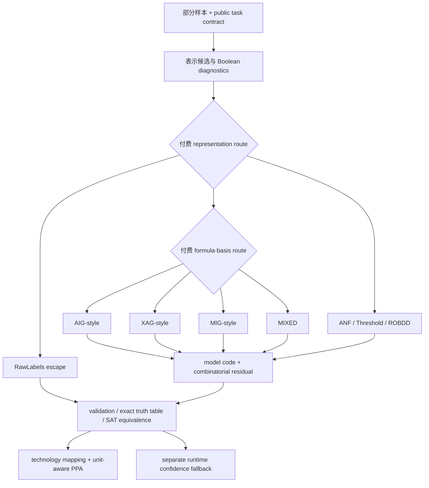

# 离散化与逻辑门化归纳偏置更新（2026-07-15）

## 结论

当前证据**没有找到一个对所有 Boolean 任务都最佳的单一门基**。更稳妥的下一步归纳偏置是一个**付费的层级 mixture-of-languages / mixture-of-bases**：先在 RawLabels、ANF、threshold、ROBDD、gate formula 等表示语言之间付费选路；只有进入 gate formula 路由后，再在 AIG/XAG/MIG-style 与 MIXED 公式基之间付费选路，并继续支付模型与组合残差码。

这是一项由现有证据支持的**设计假设**，还不是已经训练完成的统一 router。当前仓库分别验证了表示码、function/task MDL、basis-aware exact formula oracle 和运行时 confidence fallback；它们尚未被序列化为同一个 end-to-end payload，也没有在部分样本上联合学习。

## 正式运行与证据边界

本轮正式实验在 210 服务器主机 `hi-X640-G40` 上从 clean commit `5cddc7f4bd4df878359e1e60a765cd0f4db22aa2` 启动，环境为 Python 3.10.20、NumPy 1.25.2、pandas 2.3.3、matplotlib 3.10.9，并显式设置 `OMP/OPENBLAS/MKL/NUMEXPR_NUM_THREADS=1`。完整 provenance 与规范化 SHA-256 位于：

- `results/runs/circuit_bias_v0_full_210_5cddc7f/metadata.json`；
- `results/discrete_theory_metadata.json`；
- `results/rate_logic_metadata.json`。

新 oracle 穷举 3 输入全部 256 个 Boolean 函数，在 4 个公式基下产生 1,024 行结果。它精确证明的是**最小公式树 primitive occurrence 数**。从保留的最小公式 witness 做 structural hash-cons 只给出一个 observed DAG 上界；码长也只是该 witness 的可译码上界，不是 minimum DAG、minimum AIG/XAG/MIG、minimum code 或硬件 PPA。

## 1. 公式基结果：任务相关，而非单基统治

| 公式基 | 平均最小公式 primitive 数 | 平均 observed hash-cons DAG 上界 | 平均付费 model-code 上界 | 最短付费 witness-code（含 ties） | 唯一最短 |
|---|---:|---:|---:|---:|---:|
| AIG-style | 3.328 | 3.266 | 41.539 bits | 96 / 256 | 88 |
| XAG-style | 2.320 | 2.320 | **31.477 bits** | **128 / 256** | **120** |
| MIG-style | 2.781 | 2.781 | 48.375 bits | 16 / 256 | 8 |
| MIXED | **2.102** | **2.102** | 35.250 bits | 40 / 256 | 32 |

`MIXED` 的 primitive 数对 256/256 个函数达到跨基最优是集合包含关系的直接结果：它同时包含 AND、XOR、MAJ，不能据此宣称它是更好的先验。更大的操作字母表还要支付更多操作码与搜索成本。表中的 8 个 tie 是 2 个常量和 6 个 literal，它们在四个基中均为零门，因此“含 ties”列总和大于 256。

跨基 primitive 数也不等于面积：AIG/XAG 使用二输入门，MIG 使用三输入 MAJ，所有基都把常量和 complemented edges 设为免费。只有在同一目标库完成 technology mapping 后，area、delay、wire、switching 或 FPGA LUT 才可比较。

### 具名函数

| 函数 | 最短付费 witness | 最小公式 primitive 数 | model + zero-error residual |
|---|---|---:|---:|
| `AND3` | AIG-style | 2 | 25 + 1 = **26 bits** |
| `Parity3` | XAG-style | 2 | 27 + 1 = **28 bits** |
| `Majority3` | MIG-style | 1 | 21 + 1 = **22 bits** |
| `MUX3` | MIXED | 2 | 33 + 1 = **34 bits**；AIG-style 为 36 bits |

这些结果给出可检验的 basis specialization：affine/parity 候选优先测试 XAG，majority/threshold 候选优先测试 MIG 或 threshold language，AND/OR 型控制逻辑优先测试 AIG；异构函数只有在支付 MIXED grammar 后仍更短时才进入 MIXED。XAG 在本三输入、单位 primitive、固定码法中有最低整体平均码长，但 AIG 仍有 88 个唯一最短实例，因此也不能把 XAG 外推为普适默认答案。

## 2. Boolean diagnostics 的正确角色

`boolean_diagnostics.csv` 记录 influence、Fourier degree/mass、ANF degree/term count、monotonicity、symmetry、certificate size 和 noise sensitivity。这些量适合作为候选路由的**描述性 prior 或筛选特征**，不能当成已经验证的 router：

- 它们在完整、均匀的三输入真值表上事后精确计算；
- 尚未证明能从部分样本稳定估计，也未验证能预测更大输入的最优 basis；
- certificate complexity 不是一棵可执行 decision tree，也没有测量输入分布下的 expected short-circuit depth；
- influence/noise sensitivity 可以提示 hardening 风险，但不能替代校准、margin、distribution shift 和 abstention 实验。

因此本轮支持“用 Boolean structure 生成候选并付费比较”，不支持“用一个诊断量硬编码唯一门基”。

## 3. 表示困难与搜索困难必须分开

Parity 有明确的线性 XAG 构造：`n` 位 parity 使用 `n-1` 个 XOR，8/10/12 位平衡树深度为 3/4/4。现有 GateBeam 已包含 XOR，深度上限也覆盖该构造，但五种子平均 holdout accuracy 仅为 `0.445/0.405/0.440`。这证明当前 bounded GateBeam 没有恢复一个已知存在的短表示；它与 beam/ranking search bias 的解释一致，但没有 search trace 或 beam-width/ranking ablation 来定位具体因果。

随机 LUT 是另一类控制：8/10/12 位 GateBeam holdout accuracy 为 `0.495/0.516/0.508`，MLP 同样接近随机水平。该结果说明 sampled controls 没有组合 holdout 泛化，不是对某个 sampled LUT 的电路下界。4 输入的 MDL 实验还出现少量偶然短 ANF 或 literal+residual 描述，进一步说明 almost-all counting 不能替代逐实例结论。

## 4. Hardening 与综合证据

外部 Hard-LGN v23 结果通过 `results/external/hard_lgn_v23/` 建立 provenance bridge；它来自独立项目 commit `39c73d099bdcd7068f99bdea7667ae54578c193c`，不是本仓库重跑，选定 artifact 也没有记录原环境。

下述 90 行包含同一实验族中的相关配置，不能当作 90 个相互独立的任务或总体样本。

- 90 个 validation-selected 评估行中，argmax-best-hard、best-of-32 Gumbel、truth-table refit 分别被选中 35、37、18 次；没有候选类覆盖所有已评估行。
- 强制 truth-table refit 在 12 个 held-out 比较中仅 3 次胜过 validation-selected 方法、2 次胜过 strong baseline。
- ABC 在 15/15 个已评估综合行中成功，并在各行对应的任务输入上保持 hard accuracy；这些行来自 3 个 dataset/seed 输入集合与 5 种方法的组合，不是 15 个独立任务。这仍只是任务输入上的经验等价，不是 SAT 全域 equivalence proof。
- 报告的 29.3%–71.5% 只比较 pre-BLIF node count 与 post-ABC AIG AND count，跨表示、跨单位，不能解释成严格 AIG reduction 或 PPA。

这支持“生成多个 hardening 候选，再用独立 validation/verification 选择”，不支持单一 hardener。组合 residual mask、RawLabels 无损 escape、运行时 confidence fallback 是三个不同机制，必须分别记账和验证。

## 5. 推荐的下一阶段归纳偏置

建议测试的统一码长目标为：

\[
L_{proposed}
=L_{representation\ route}
+L_{basis\ route}
+L_{model}
+L_{residual}.
\]

硬件约束只能作为带单位的外部项，例如 `+ λ_A·area + λ_D·delay + λ_W·wire`，不能直接冒充 Shannon bits。MCR² 可以继续作为连续表示几何或优化流的辅助正则，但本仓库已证明 ΔR 增大时 Boolean code 和 gate count 可以完全不变，因此不能用它替代上述离散码长或综合成本。

## 6. 已验证与待验证

本仓库已验证：

- 完整三输入空间上四个付费 formula-basis 候选的 exact minimum formula 结果与 witness 上界；
- 原有多语言 MDL 的 route tag、residual 和 raw escape；
- parity 的短 XAG 构造与 GateBeam search failure 的分离；

外部已审计：

- 外部 Hard-LGN hardening/ABC artifact 的受限审计结论。

仍是 proposed/planned：

- 从部分样本联合学习 representation route 与 basis route；
- 在同一搜索中比较 approximate formula + residual，而不只保留 exact witness；
- diagnostics 的可估计性、basis-prediction accuracy 与大输入外推；
- beam/ranking/basis ablation、margin 和 distribution-shift abstention；
- exact DAG/SAT synthesis、ROBDD/decision-tree expected depth、SAT equivalence；
- 同一 target library 下的 technology-mapped PPA。

所以，对“最适合离散化和逻辑门化的归纳偏置”的当前回答是：**不是固定 AIG、XAG、MIG 或 MIXED，而是一个预先声明、显式付费、带 raw escape 与 residual 的层级混合先验；各 basis 由任务结构生成候选，再由可译码总成本与独立验证选择。**
